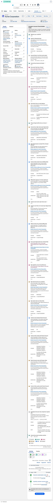

# Record Health Check

     

> **Make informed decisions before taking action on Salesforce data.**

Record Health Check is a metadata-driven framework that evaluates a Salesforce record directly on its record page. It provides read-only guidance about what needs attention, why it matters, and how to resolve it, without modifying the record or blocking users.

Every Rule returns **Pass**, **Fail**, **Skipped**, **Unable to Check**, or **System Error** on the
card. Fail rows show **Failed**, **Warning**, or **Info** by severity. When a record needs attention,
the card explains what was **Found** and **Expected**, and provides fix instructions with an optional
read-only **Fix it** link.

**Check Sets** and **Rules** are defined in Custom Metadata. The framework evaluates them at read time, so one card can review the current record, related records, aggregate results, and data that existed before the Rules were created, all without writing to the record.

> [!NOTE]
> Record Health Check provides advisory guidance; it never blocks a save. When Salesforce must
> prevent a record change, use a Validation Rule, Flow, or Apex trigger instead.

[Documentation](docs/README.md) ·
[How it works](docs/installation/01-how-it-works.md) ·
[Install](docs/installation/02-install-and-verify.md) ·
[Examples](docs/examples/README.md) ·
[Try the demo](docs/installation/05-create-rhc-scratch-org.md) ·
[Support](SUPPORT.md) ·
[Security](docs/reference/framework/02-security.md) ·
[Changelog](CHANGELOG.md)

## Demo

<table>
  <tr>
    <td width="48%" valign="top">
      
<b>Example:</b> <b>Account Relationship &amp; Risk Health Check</b>

      
An account team can review relationship strength, ownership, engagement, revenue coverage, and customer risk without leaving the record page.

      <ul>
        <li><b>Review the whole relationship.</b> Rules evaluate the Account together with Opportunity Contact Roles, Contacts, Opportunities, Cases, Activities, ownership, and parent-account context.</li>
        <li><b>See business evidence.</b> Found and Expected values explain results such as three reachable Executive Sponsors, six contacts missing email, four high-priority cases, and a dynamically calculated 75% revenue-coverage target.</li>
        <li><b>Understand every outcome.</b> Passed Rules remain compact, issues include severity and corrective guidance, and skipped Rules explain the business reason they do not apply to this Account.</li>
        <li><b>Act on the risk.</b> Remediation guidance directs the account team toward the ownership, relationship, pipeline, or service action that closes the gap.</li>
      </ul>
      
<b>Administrators control the experience</b>

      <ul>
        <li>Each check shown on the card is a Rule in the selected Check Set.</li>
        <li>Custom Metadata defines what each Rule evaluates, when it applies, and whether the card runs when the page opens or when the user selects <b>Run</b>.</li>
        <li>The same component can be configured for any Salesforce object with a record page.</li>
      </ul>
    </td>
    <td width="52%" valign="top">
      
    </td>
  </tr>
</table>

### What this example demonstrates

- **Formula checks** evaluate Account ownership and parent-account alignment.
- **Related-record and aggregate queries** measure executive sponsorship, contact reachability,
  pipeline coverage, and open customer issues.
- **Custom Apex** evaluates recent Tasks and Events within a configurable 90-day window.
- **Applicability rules** skip channel governance for a direct customer and explain why.

## What you get

### On the record page

| What users see                                                      | Why it helps                                                                                                                                     |
| ------------------------------------------------------------------- | ------------------------------------------------------------------------------------------------------------------------------------------------ |
| A Check Set card on the Lightning record page                       | Guidance appears where people already work, not in a separate report or dashboard                                                                |
| Pass, Fail, Skipped, Unable to Check, or System Error for each Rule | Outcomes stay honest: not applicable and "could not evaluate" are not forced into pass/fail; Fail rows show Failed, Warning, or Info by severity |
| Severity, Found, and Expected on issues                             | Failures show what was observed versus what the Rule required                                                                                    |
| Fix instructions and an optional **Fix it** link                    | Remediation stays on the card and is read-only; the Framework never writes the record                                                            |

### Configuration

| What you configure                      | Why it helps                                                                                         |
| --------------------------------------- | ---------------------------------------------------------------------------------------------------- |
| Check Sets and Rules in Custom Metadata | Version, review, and deploy readiness logic like other Salesforce metadata                           |
| Four Evaluation Types                   | Formula on the current record, Query over related data, Compare two queries, or custom Apex          |
| Applicability conditions                | Skip Rules that do not apply (for example Partner-only checks on a Customer Account) and explain why |
| Run timing and card display             | Run on open or on demand; control how passed and skipped Rules appear                                |
| Adaptive SLDS card treatment            | Automatically follows the active Salesforce design system without per-page configuration             |

### Also available

- The Framework ships four Demo Check Sets (`Example_…`, card titles prefixed with `Demo:`) for Account, Contact, and Opportunity; additional teaching packs live in [RecordHealthCheck-Examples](https://github.com/gkolan/RecordHealthCheck-Examples)
- `Record_Health_Check_User` and `Record_Health_Check_Admin` permission sets (runner vs configure/troubleshoot)
- Opt-in platform events for Set runs and Rule results, plus Apex and Flow entry points for automation
- Diagnostics gated by permission so troubleshooting detail stays off everyday cards

Start with [How it works](docs/installation/01-how-it-works.md), [Install](docs/installation/02-install-and-verify.md), or the [examples library](docs/examples/README.md).

## Contributing

Planning to contribute? See [Contributing](.github/CONTRIBUTING.md) for local checks, testing requirements,
and pull request guidance. For questions and bug reports, see [Support](SUPPORT.md).

## License

Licensed under the [Apache License, Version 2.0](LICENSE). See [NOTICE](NOTICE) for attribution.
