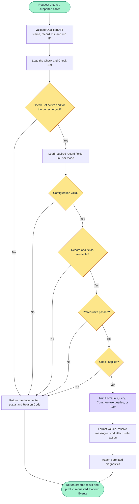

# Framework architecture

Audience: package maintainers and technical reviewers. Administrators should start with
[How it works](../start-here/what-it-does.md) and
[Configure Check Sets and Checks](../build-checks/configure-check-sets-and-checks.md).

> [!NOTE]
> This page explains how Record Health Check differs from save-time automation, how a Check runs,
> where access and limits are enforced, how results can be saved or published, and which Apex class
> owns each responsibility.

Record Health Check evaluates Custom Metadata Checks against a Salesforce record on a Lightning
page or a limited list of record IDs supplied by Apex or Flow. It returns a Status, Reason Code, and
optional display content for each Check and record. Checks are grouped into a **Check Set** for one
object. Evaluation is read-only and runs with the calling user's access. The same Apex code serves
the Lightning Web Component, the public Apex API, and two Flow actions.

Field-level detail, operator behavior, and configuration procedure live in the pages listed under
[Related references](#related-references).

## 1. Position in the platform

Validation Rules, record-triggered Flows, and Apex triggers run while Salesforce saves a record and
can stop the save. Record Health Check answers a different question: “Does this record meet our
current data expectations now?” It can check existing records without editing them.

| Property | Design consequence |
| --- | --- |
| Existing records | A Check can evaluate records saved before the Check existed |
| Contextual | Inputs include related records, aggregates, and time windows, so evaluation needs SOQL beyond the record being viewed |
| Guidance, not save blocking | A health check does not change the checked record or stop a save; `FAIL` tells the user or automation that the record did not meet a Check |

| Mechanism | Evaluates | Failure effect |
| --- | --- | --- |
| Validation Rule, record-triggered Flow, Apex trigger | The record being saved | Can block the save |
| Report, dashboard, list view | Many records independently of any one record save | None |
| Record Health Check | One record on read, per Check Set | Returns `FAIL` at the configured severity, with no transactional effect |

An invalid health-check formula or SOQL query returns a documented result instead of blocking every
future save. Administrators should still test Checks in a sandbox before activating them.

## 2. Design principles

| # | Principle | Consequence in the code |
| --- | --- | --- |
| 1 | Configuration before custom code | Most questions live in Check Custom Metadata; Apex is available when Formula or Query cannot express the requirement |
| 2 | Fail visible, never silent | Every failure returns a documented status and a stable reason code |
| 3 | Security is not optional | SOQL runs `WITH USER_MODE`; `WITH SYSTEM_MODE` is rejected before execution |
| 4 | Hard limits by design | Checks per Check Set, query rows, merge tokens, and message size all have fixed maximums |
| 5 | One approved value list | The same allowed values and limits are used when a Check runs and when package maintainers audit metadata |
| 6 | Stable integration values | Integrations use Status and Reason Code, never editable display wording |
| 7 | Plain language | Public names and messages use Salesforce Setup terms |

## 3. What ships in the package

| Surface | Role |
| --- | --- |
| **Record Health Check Set** (`Record_Health_Check_Set__mdt`) and **Record Health Check** (`Record_Health_Check__mdt`) | Check definitions, result and Run/Rerun display settings, optional health-result Platform Events, and explicitly enabled Error Log events |
| Apex classes for four Evaluation Types | Formula, Query, Compare two queries, and Apex evaluation |
| Lightning Web Component | Record-page card, one Apex call per Check, progressive reveal |
| Public Apex API, Batch, Queueable, Scheduled Apex, and two Flow actions | The same evaluation code for automation and integrations |
| `Record_Health_Check_Set_Run__e` and `Record_Health_Check_Result__e` | Optional Platform Events after deliberately started runs |
| `Record_Health_Check_Log__e` | `ERROR` detail published through `RecordHealthCheckLogger.flush()` |
| Six Permission Sets and two Custom Permissions | **Card User** grants the record-page card, **User** grants broader runtime entry points, **Admin** grants configuration and diagnostics, **MCP Integration** grants only the versioned REST adapter, **Diagnostics Viewer** adds diagnostic visibility to an existing runner, and **Error Log Publisher** grants restricted log-event publication. The Custom Permissions separately gate runs and diagnostics. |

Record Health Check does not create history records. Apex, Flow, and custom Batch classes can save
the returned results directly to a custom object created by your team. Platform Events are optional
when another Flow, Apex trigger, or external integration should receive results after the run.

## 4. The configuration model

Configuration is Custom Metadata, so it deploys as metadata, consumes no record storage, and its
SOQL does not count against the query governor limits that Check queries do.

```text
Record_Health_Check_Set__mdt          one card on one object
  ObjectApiName__c                    which object the card belongs to
  IsActive__c, CardRunMode__c         whether it runs, and on load or on request
  CardRevealMode__c                   whether Check rows appear progressively or together
  PassedChecksDisplay__c              whether passed rows remain visible
  SkippedChecksDisplay__c             whether skipped rows remain visible

  FoundExpectedDisplay__c             when Found and Expected evidence appears
  SummaryDisplay__c                   whether overall/category summaries appear above or below rows
  ShowDiagnostics__c                  whether troubleshooting detail may be shown
  PublishUserRunEvent__c              card Run/Rerun can publish Record_Health_Check_Set_Run__e
  PublishErrorLogEvent__c             publishes Record_Health_Check_Log__e (default off)
      |
      | one Check Set has many Checks (metadata relationship)
      v
Record_Health_Check__mdt              one row on the card
  EvaluationType__c                   FORMULA | QUERY | COMPARE_TWO_QUERIES | APEX
  ApplicabilityMode__c                whether this Check applies to this record at all
  PrerequisiteCheck__c                another Check that must pass first
  ComparisonOperator__c               how Found is compared to Expected
  FailureSeverity__c                  CRITICAL | WARNING | INFO
  CheckTitle__c, FailureMessage__c    what the user reads
  PublishUserResultEvent__c           card Run/Rerun can publish Record_Health_Check_Result__e

Publication paths
  Programmatic run with ACTIONABLE or ALL --after commit--> result and set events
  Person clicks Run/Rerun and metadata enables events --after commit--> result and set events
  Record Health Check records ERROR --immediately--> Record_Health_Check_Log__e
```

A Check always belongs to a Check Set, and Apex enforces that relationship on every call. A caller
can select one Check by its Qualified API Name, but Record Health Check still loads and validates its
parent Check Set. An inactive Check Set or one for a different object cannot run.

### Platform Event configuration

| Configuration owner | Setup field | Default | Platform Event and behavior |
| --- | --- | --- | --- |
| Check Set | **Publish User Run Event** (`PublishUserRunEvent__c`) | Off | When a person clicks Run or Rerun, publish one `Record_Health_Check_Set_Run__e` summary per checked record |
| Check | **Publish User Result Event** (`PublishUserResultEvent__c`) | Off | When a person clicks Run or Rerun, publish `Record_Health_Check_Result__e` for this Check |
| Check Set | **Publish Error Log Event** (`PublishErrorLogEvent__c`) | Off | Publish restricted `Record_Health_Check_Log__e` details for package `ERROR` logs after explicit enablement and publisher permission assignment |

Automatic record-page evaluation never publishes Check Set Run or Check Result events. Apex, Flow,
Batch, Queueable, and Scheduled requests use their explicit `NONE`, `ACTIONABLE`, or `ALL` choice;
they do not use the two **Publish User...** settings. An Error Log event is separate. Platform Event
publication does not create a history record by itself; a receiving Flow, Apex trigger, or external
integration must save the event when the org needs retention or reporting. See
[Lifecycle events](../save-results/when-to-use-platform-events.md) for examples and transaction timing.

| Evaluation Type | Input | Evaluation mechanism |
| --- | --- | --- |
| `FORMULA` | Fields on the record and fields reachable by Salesforce formula syntax | `FormulaEval` evaluates the Boolean Pass Condition directly |
| `QUERY` | One SOQL query stored by an administrator | Rows or an aggregate interpreted by `QueryResultHandling__c`, then compared with the selected operator |
| `COMPARE_TWO_QUERIES` | Two SOQL queries stored by an administrator | One value from each query is compared, or both query results are compared as lists |
| `APEX` | A class implementing `RecordHealthCheckPlugin` | One call returns a result for every requested record ID |

## 5. Layers

Higher layers call lower layers, and lower layers never call back up. The classes that receive the
initial request do not calculate health results themselves. Result and Lightning definition classes
do not depend on other package classes.

```text
L5  Ways to start a health check
    RecordHealthCheck (Apex API) | Flow actions | RecordHealthCheckController (Lightning card)
    Owns: caller-specific inputs and outputs

L4  Request coordination
    RecordHealthCheckScopePipeline
    Owns: Check loading, request limits, record loading, prerequisites, applicability,
          Evaluation Type choice, result creation, diagnostics, Platform Event publication

L3  Evaluation Type classes
    Formula | SOQL | Compare two queries | Apex
    Plus RecordHealthCheckQueryEvaluatorSupport for shared query execution

L2  Shared package services
    Config, SOQL template safety, comparison, display formatting, value handling,
    merge tokens, describe cache, logger, access, constants, validators

L1  Request, result, and Lightning definition types
    Request, Response, EvaluationResult, ResultDisplay, Definition,
    Scope, Outcome, Value, Check interface, AdminDetail
```

The Lightning controller, the public Apex API, and the Flow actions all call the same request
coordination class. There is no separate calculation for the user interface. A result shown on the
card and a result returned to Flow therefore come from the same evaluation code.

### Why the implementation is split

Each supporting class has one named responsibility. This keeps query preparation, comparison,
formatting, access, and event publication independently reviewable and testable.

| Owner | Responsibility kept out of its caller |
| --- | --- |
| `RecordHealthCheckScopePlanner` | Selection, request budgets, applicability, and prerequisite planning |
| `RecordHealthCheckScopeResultSupport` | Result conversion, diagnostics, display shaping, and URL safety |
| `RecordHealthCheckDefinitionLoader` | Definition queries, validation, inactive labels, and display settings |
| `RecordHealthCheckConfigFindingMapper` | Conversion from shared validation findings to results returned when a Check runs |
| `RecordHealthCheckApexResultFinalizer` | Custom Apex Check outcome validation and error-result completion |
| `RecordHealthCheckCompareQuerySupport` | Side-specific query reduction for compare-two-query evaluation |
| `RecordHealthCheckSoqlEvaluation` | Query-result decisions after template preparation and execution |
| `RecordHealthCheckSoqlTokenBinder` | Merge-token replacement and safe SOQL text values |
| `RecordHealthCheckSoqlBindValueResolver` | Salesforce field lookup and fallback conversion to the field's data type |
| `RecordHealthCheckFormulaSyntax` / `RecordHealthCheckFormulaDisplay` | Formula parsing and display shaping as separate concerns |
| `RecordHealthCheckComparisonDisplay` | Display alignment after comparison without changing the compared values |
| `RecordHealthCheckDisplayCurrencyResolver` / `RecordHealthCheckDisplayCurrencyRenderer` | Currency context and currency rendering |
| `RecordHealthCheckDisplayFieldResolver` / `RecordHealthCheckDisplayNumberRenderer` / `RecordHealthCheckDisplayTextRenderer` | Field extraction and type-specific rendering |
| `RecordHealthCheckMetadataSetValidator` / `RHCMetadataDependencyValidator` / `RecordHealthCheckMetadataIssueMapper` | Set validation, dependency validation, and issue mapping |
| `RecordHealthCheckTemplateParser` | Token parsing independent of token resolution |
| `RecordHealthCheckTemplateValueResolver` | Read the value named by a merge token |

Other package classes call these owners directly, and tests target the same class. Custom Apex in an
org that installs Record Health Check should use the documented `global` entry points. The 500-line
repository check is a review ceiling, not the reason the responsibilities are separated.

## 6. How one Check is evaluated

The supported entry points use `RecordHealthCheckScopePipeline.evaluate`, which returns one ordered
response for the selected Check or Check Set and record IDs. A problem that affects one Check can
become a Status and Reason Code. An invalid request or a Salesforce governor-limit failure can still
stop the Apex transaction.

### Evaluation flow



Text fallback:

```text
Request -> validate names and IDs -> load configuration -> active/object/limit checks
        -> load records in user mode -> validate each Check -> field access
        -> prerequisite -> applicability -> evaluate -> format result
        -> attach permitted diagnostics -> publish requested events -> return response

Any decision that cannot continue returns its documented status and Reason Code.
```

1. **Normalize the request.** Qualified Check Set or Check identity and run id are trimmed and
   length-capped before anything else uses them. The public request contract rejects null record
   IDs before evaluation; the Lightning boundary reports missing record context safely.
2. **Load the Check inside its Check Set.** Inactive Checks are loaded too, so the result can say
   `CHECK_INACTIVE` rather than the misleading `CHECK_NOT_FOUND`.
3. **Confirm the Check Set context.** The Check Set must be active and must target the object of the
   record being evaluated. The Lightning card can show `CONFIG_INACTIVE` or `OBJECT_MISMATCH`; a
   direct Apex or Flow request rejects an invalid selection before running Checks. This step also
   reads `ShowDiagnostics__c` for the run.
4. **Load the records.** One query runs `WITH USER_MODE` and selects only the fields the Checks need,
   including fields found by following formula dependencies. A record not returned by that query
   uses `RECORD_NOT_VISIBLE`. A required unreadable field is hidden behind the public
   `CANNOT_EVALUATE` code and appears as `FIELD_NOT_ACCESSIBLE` only in authorized diagnostics.
5. **Validate each Check.** Validation confirms the Check's fields are complete and consistent for
   its Evaluation Type. An invalid Check returns the appropriate configuration Reason Code.
6. **Apply the prerequisite Check.** If the Check names a prerequisite, that earlier Check must have
   returned `PASS`. Otherwise this Check returns `SKIPPED` with `PREREQUISITE_NOT_MET`. A circular
   dependency returns `CIRCULAR_DEPENDENCY` instead of repeatedly evaluating the same Checks.
7. **Apply the applicability check.** `ALL_RECORDS`, `WHEN_FORMULA_TRUE`, or
   `WHEN_COUNT_QUERY_MATCHES` decides whether this Check applies to this record right now. A Check that
   does not apply is `SKIPPED` with the administrator's configured message.
8. **Run the Evaluation Type.** Formula, Query, Compare two queries, or Apex produces Found, Expected,
   and a status.
9. **Format Found and Expected.** The selected display format is applied without changing the original
   values used for the comparison. Each side and each list row keeps its own currency where one is
   available.
10. **Resolve merge tokens in messages.** An invalid token can make the Check
    `UNABLE_TO_EVALUATE` with a token-related Reason Code. Record Health Check does not return a
    partly resolved message.
11. **Attach the fix link on failure only.** The action URL is token-resolved against the record, then
    cleaned up before it can become a link.
12. **Apply Check Set flags.** Diagnostics detail is attached only when the Check Set enables it and
    the running user holds the diagnostics permission.
13. **Publish requested Platform Events.** Programmatic calls use `NONE`, `ACTIONABLE`, or `ALL`.
    Lightning button runs use the Check Set and Check publication settings. Publication failure is
    logged and does not replace the health results.

Two caches keep a single transaction efficient without leaking between runs. Describe results are
reused for the whole transaction. Check results are reused only while one top-level evaluation walks
its prerequisite chain, then cleared, so a later call in the same transaction never sees a stale
result.

## 7. Entry points

| Entry point | Used by | What it adds around the health check |
| --- | --- | --- |
| `RecordHealthCheck.evaluate(request)` | Apex, Batch, Scheduled Apex, tests | Qualified API Name, record IDs, result mode, Platform Event choice, and run ID |
| `RecordHealthCheckRunCheckFlowAction` | Flow Builder | Invocable inputs and a versioned response, including result JSON |
| `RecordHealthCheckRunSetFlowAction` | Flow Builder | The same for a whole Check Set |
| `RecordHealthCheckController` | The Lightning card | Availability, lightweight shell configuration, definitions, one evaluate call per Check, and `completeRun` |

Each entry point supplies a **source** value that travels with the run. Publishable programmatic
and deliberate sources include `APEX_API`, `FLOW`, `USER_INITIATED`, `SCHEDULED`, `BATCH`,
`QUEUEABLE`, `FUTURE`, and `AGENT`. Automatic card loads carry `RUN_ON_LOAD`, which the Lightning
controller keeps non-publishable, so page views generate no health-result Platform Events. The browser may
request only the two Lightning values, and the server substitutes `RUN_ON_LOAD` for anything else.

**Lightning record page:** initial rendering calls `getCheckSetShellConfig` for the active Check
Set's run mode, title, subtitle, active Check count, and Run-button presentation. Manual mode then
waits for Run; automatic mode waits for browser idle.

When execution begins, the component calls `getCheckDefinitions` once, then `evaluateCheck` once per
Check, at most five calls in flight, so each Check is its own Apex transaction. On a
`USER_INITIATED` run, `completeRun` does not evaluate the Checks again. It filters the completed
browser results to the current record and the Checks in the resolved Check Set, rejects duplicates,
calculates the summary from the accepted results, and then publishes the Check Result and Check Set
Run events enabled in Custom Metadata. Treat those events as notifications; automation making a
security-sensitive or business-critical change should
reevaluate through Apex or Flow.

The card serializes each completion entry in the public `RecordHealthCheckResultItem` shape, with a
nested `evaluation` object containing the qualified Check name, record ID, status, severity, and
reason code. The server does not accept the card's flattened display view model as this contract.

**Apex and Flow:** each direct request checks no more than 200 records in one transaction and
publishes only according to its explicit `NONE`, `ACTIONABLE`, or `ALL` choice. It does not use the
Lightning card's publication settings.

Evaluation itself is read-only, with `with sharing` classes and `WITH USER_MODE` queries. Publishing
health-result and Error Log Platform Events is the one intentional write on that path.

## 8. Results and contracts

Every Check returns exactly one Status, with a stable Reason Code where one applies.

| Status | Meaning |
| --- | --- |
| `PASS` | The configured comparison held |
| `FAIL` | The comparison did not hold, carrying the `FailureSeverity__c` value |
| `SKIPPED` | The applicability check excluded the record, or a prerequisite Check did not pass |
| `UNABLE_TO_EVALUATE` | Configuration, access, or input data prevented a determinate answer |
| `ERROR` | An unexpected Apex, custom Apex Check, or Salesforce failure |

The version fields do not all describe the same contract.

| Version | Applies to | Current value |
| --- | --- | --- |
| Flow response contract | **Contract Version** returned by each installed Flow action | `2.0` |
| Event contract | The `ContractVersion__c` field on each platform event | `1.0` |
| Package version reported on events | `FrameworkVersion__c` | Independent of both contract versions |

`RecordHealthCheckResponse` does not contain a `contractVersion` field; its installed global Apex
types are the compile-time contract. A contract can add fields, so receivers must ignore fields they
do not recognize. Removing or renaming a public operation, field, Status, or Reason Code requires a
new contract version. Branch automation on Status and [Reason Code](../reference/results/reason-codes.md),
never on display text an administrator can edit.

## 9. Security model

Record Health Check evaluates with the running user's access, rejects unsafe query shapes, and
keeps diagnostics and error details behind explicit permissions. For Permission Sets, saving
results, Platform Events, custom Apex Checks, and Action URLs, see
[Security and data access](./security-and-data-access.md).

| Concern | Approach |
| --- | --- |
| Record and field access | The running user's own access, enforced by `WITH USER_MODE` on every query |
| SOQL stored by an administrator | Template checks reject data-changing keywords and `WITH SYSTEM_MODE`, then insert `WITH USER_MODE` in the correct position |
| Check selection | A Check is always loaded with its parent Check Set, so an inactive Check or a Check from the wrong object cannot run |
| Merge tokens | Only known tokens resolve, with caps on token count and completed message size |
| Fix links | Same-org relative paths or `https://` only, length-capped, and checked again in the component before use as a link |
| Diagnostics detail | Requires the **Record Health Check View Diagnostics** (`rhc__Record_Health_Check_View_Diagnostics`) Custom Permission and a Check Set that enables Show Diagnostics |
| Lightning event input | `completeRun` accepts only a button-initiated run, the current record, and one result for each configured Check; it calculates counts from the accepted results |
| Error messages | Public responses return a safe message and a Reason Code; exception text stays in authorized diagnostics |

The installed **Card User**, **User**, and **Admin** Permission Sets include the **Record Health
Check Run** Custom Permission and the Apex access appropriate to their surfaces. **Record Health Check Admin**
(`rhc__Record_Health_Check_Admin`) also includes **Record Health Check View Diagnostics**, setup
access for the Custom Metadata, and Apex class access for the package metadata validator.
**Record Health Check Diagnostics Viewer**
(`rhc__Record_Health_Check_Diagnostics_Viewer`) includes only View Diagnostics and must be combined
with an appropriate runner Permission Set.

## 10. Limits

Saved-field limits are in [Field limits](../reference/configuration/field-limits.md); request limits are defined in
`RecordHealthCheckConstants`.

| What is capped | Cap | Enforcement point |
| --- | --- | --- |
| Checks per Check Set | 25 | The Lightning card shows the first 25 and the metadata audit warns; direct Apex and Flow reject a larger active set |
| Rows returned by one Check query | 2,000 | `RecordHealthCheckSoqlTemplate` rewrites the outer `LIMIT` |
| Records per direct Apex or Flow request | 200 | The request is rejected before any Check runs; use Batch Apex for more records |
| Merge tokens in one message | 100 | `RecordHealthCheckTemplateService`, returning `TOKEN_LIMIT_EXCEEDED` |
| Resolved message length | 20,000 characters | `RecordHealthCheckTemplateService`, returning `RESOLVED_TEMPLATE_TOO_LONG` |
| Fix link length | 2,000 characters | Apex safe-link handling, then `healthCheckPresentation` before binding an `href` |
| Formula Evaluation calls per transaction | 95 package safety limit below Salesforce's 100-call limit | The request is rejected when the planned calls exceed the remaining safe amount; an unexpected overrun returns `FORMULA_EVAL_LIMIT` |
| Evaluate calls in flight from the card | 5 | `healthCheckRunner` queue |

Some limits return a per-record Reason Code; request limits throw an Apex exception or return a Flow
error before any Check runs. Formula Evaluation use accumulates across the whole transaction rather
than resetting for each Check, because Salesforce applies the 100-call limit to the transaction.

## 11. Configuration is checked in two places

The same allowed values and caps are checked at two different moments, and both read them from
`RecordHealthCheckConstants` so they cannot get out of sync.

| When | Class | What happens on failure |
| --- | --- | --- |
| A Check runs | `RecordHealthCheckConfigService` with `RecordHealthCheckValidator` | The Check returns `UNABLE_TO_EVALUATE` with the applicable configuration Reason Code |
| A package maintainer runs the metadata audit before a release | `RecordHealthCheckMetadataValidator` | The audit returns errors and warnings for Custom Metadata that must be reviewed before release |

## 12. Observability

| Information | Where to find it | Notes |
| --- | --- | --- |
| Structured `[RHC]` debug lines | Salesforce debug logs | Every line carries the run id and the running user |
| `Record_Health_Check_Log__e` | Receiving Flows, Apex triggers, and monitoring tools | `ERROR` detail held during the run and published by `flush()` when Error Log publication is enabled |
| `Record_Health_Check_Set_Run__e` | Receiving Flows, Apex triggers, and external integrations | Published according to the programmatic request choice or Lightning button-run setting |
| `Record_Health_Check_Result__e` | Receiving Flows, Apex triggers, and external integrations | Published according to the programmatic request choice or Lightning Check setting |
| Show Diagnostics on the card | The Lightning record page | Requires the diagnostics Custom Permission |

Health-result publication is limited to deliberately started runs and is best effort. Programmatic
requests choose `NONE`, `ACTIONABLE`, or `ALL`; Lightning button runs use Custom Metadata. Events
publish in groups of 100, and a failed publish is logged instead of failing the health check. A Flow
or Apex trigger receiving an event must avoid starting the same health check again, or it can create
a loop.

## 13. Ways to use the results

| Option | Use it when |
| --- | --- |
| Formula, Query, or Compare two queries Checks | The condition is expressible in Custom Metadata with the shipped operators |
| A class implementing `RecordHealthCheckPlugin` | The Check needs Apex logic or several Salesforce queries; custom Apex Checks cannot make callouts or perform other prohibited actions |
| Flow actions and the Apex API | Evaluation is driven by automation rather than a record page |
| Save the returned results in Apex, Flow, or a custom Batch `execute()`/`finish()` process | Your team needs history or reporting in a custom object it creates and controls |
| Platform Event receivers | A Flow, Apex trigger, or external integration should receive results after the run without being part of the checking transaction |

A custom Apex Check receives one read-only `RecordHealthCheckScope` and returns a map with one
`RecordHealthCheckOutcome` for every requested record ID. Record Health Check calls it once for all
IDs, confirms that no result is missing or extra, and rejects record changes, callouts, email,
Platform Event publication, and additional Queueable, Batch, Scheduled, or future Apex.

## 14. Delivery and environments

Customers install the promoted namespaced second-generation unlocked package (`rhc`). The stable `04t` ID
lives in [`config/package-releases.json`](../../config/package-releases.json). Contributors deploy
unpackaged source from `packages/record-health-check/force-app` through
`packages/record-health-check/manifest/package.xml` using [`npm run dev:setup`](../contributing/source-development.md).

After installation, Salesforce includes `rhc__` where package-owned metadata requires it. A Check
Set created by an administrator in your org normally has no `rhc__` prefix. Always copy the exact
**Qualified API Name** from Setup instead of adding or removing the prefix.

Operational consequences:

- The installed package includes four active Example Check Set records (`Example_…`, card titles
  prefixed with `Example:`). They contain 50 Checks, of which 49 are active. Matching integration-test copies live under
  `packages/record-health-check/integration-tests/`.
- Check Sets and Checks are Custom Metadata, so they deploy between orgs and version control
  alongside the classes they configure.
- Qualified API Names identify Checks and Check Sets in the Apex API, Flow actions, Lightning card,
  and Platform Events. Copying the exact value avoids a package-prefix mismatch.
- `npm run check:manifest` compares every packageable source member with
  `packages/record-health-check/manifest/package.xml`.
  `npm run check:permission-sets` checks permission-set component references and keeps descriptions
  within a 200-character project budget, below Salesforce's 255-character limit. CI runs both
  checks before creating the scratch org.

### Multi-currency behavior

Multi-currency support applies wherever Record Health Check displays money. Formula, Query, Compare two
queries, and custom Apex Check results can carry a currency for each side; list entries can carry a
currency per row. Aggregate amounts use the corporate currency Salesforce uses for the aggregate.
Single-currency orgs show a symbol, while orgs with multiple currencies lead with the ISO code.

Record Health Check does not convert currencies or adjust comparisons between different currencies. Comparisons use
the values and Salesforce data types returned by the query or formula. Currency conversion, dated exchange rates, and business checks
for comparing unlike currencies remain the responsibility of the Check query, formula, or Apex
custom Apex Check. See [Display value format](../reference/configuration/display-found-and-expected.md#currency).

## 15. Design decisions

| Decision | Rationale |
| --- | --- |
| One Check per Apex call from the card | Isolates each Check in its own transaction and lets results render as they complete |
| Card completion results filtered in `completeRun` | Apex accepts only the current record and configured Checks, calculates counts from those accepted results, and treats the event as a notification rather than a new trusted evaluation |
| Automatic card loads cannot publish events | Ordinary page views should not create unlimited Platform Event traffic |
| Catchable evaluation failures become results | Apex, Flow, and Lightning use the same result format; invalid requests and Salesforce governor-limit failures can still stop the transaction |
| Allowed values in one constants class | Check execution and the package metadata audit read the same approved values |
| SOQL stored by an administrator is prepared before it runs | `WITH USER_MODE`, rejection of data-changing keywords, and the row limit must be applied before execution |
| Check results cached only inside one top-level run | Prerequisite chains avoid re-evaluation without leaking stale results into a later run in the same transaction |

## 16. Out of scope

- No create, update, or delete operation on the checked record, and no participation in save-time validation.
- No package-owned result history. Save returned results directly to a custom object created by your
  team, or use a receiving Flow/Apex trigger to save Platform Events.
- Scheduled runs use `RecordHealthCheckScheduled`, which launches the installed Batch class over
  an explicit list of record IDs.
- Large lists of record IDs use `RecordHealthCheckBatch`; each Batch transaction checks the selected
  number of records and has its own Salesforce limits.
- No general-purpose REST API, arbitrary query endpoint, or record-mutation endpoint. The versioned
  agent tool REST resource exposes only one-record Check and Check Set evaluation for approved
  service identities.

## 17. Class ownership map

Use this when changing code. If a responsibility moves, update this table in the same change.
For longer per-class descriptions, see [Reference: Apex classes](./apex-implementation/README.md).

### Entry points

| Class | Responsibility |
| --- | --- |
| `RecordHealthCheck` | Public `evaluate(request)` entry point |
| `RecordHealthCheckRunCheckFlowAction` and `RecordHealthCheckRunSetFlowAction` | Packaged Flow actions |
| `RecordHealthCheckRunCheckAgentAction` and `RecordHealthCheckRunSetAgentAction` | Native one-record Agentforce actions |
| `RecordHealthCheckAgentRestResource` | Versioned one-record REST boundary for approved agent tools |
| `RecordHealthCheckQueueable`, `RecordHealthCheckBatch`, and `RecordHealthCheckScheduled` | Installed Queueable, Batch, and Scheduled Apex options |
| `RecordHealthCheckAsyncSupport` | Shared record-ID and request preparation for those three Apex options |
| `RecordHealthCheckFlowSupport` | Shared Flow input checking, result lookup, response-size limit, and summary Status |
| `RecordHealthCheckFlowGroupExecutor` | Groups compatible inputs and runs them for both Flow actions |
| `RecordHealthCheckController` | Lightning card: availability, shell configuration, definitions, `evaluateCheck`, `completeRun` |
| `RecordHealthCheckScopePipeline` | Qualified API Name selection, request checks, record loading, ordered evaluation, event publication, and response creation |
| `RecordHealthCheckEvaluatorRegistry` | Sends each Evaluation Type to its matching class |
| `RecordHealthCheckFieldPlanner` | Identifies fields needed by all Checks before one user-mode record query runs |
| `RecordHealthCheckLifecyclePublisher` | Optional Set and Check platform events |
| `RecordHealthCheckRunContext` | Values carried for the duration of one run |

### Configuration and validation

| Class | Responsibility |
| --- | --- |
| `RecordHealthCheckConfigService` | Load Check Sets and Checks; build definition and availability responses |
| `RecordHealthCheckValidator` | Per-Check checks at the moment a Check runs |
| `RecordHealthCheckMetadataValidator` | Metadata audit run by package maintainers before a release |
| `RecordHealthCheckConfigValidator` and `RecordHealthCheckConstants` | Shared helpers, allowed values, and caps |
| `RecordHealthCheckReasonCodes` | Restricted reason-code helpers |
| `RecordHealthCheckSetAvailability` | Active and inactive Check Sets for an object |

### Evaluators and shared services

| Class | Responsibility |
| --- | --- |
| `RecordHealthCheckFormulaEvaluator` | Formula checks, including the transaction formula budget |
| `RecordHealthCheckSoqlEvaluator` | Single-query checks |
| `RecordHealthCheckCompareQueriesEvaluator` | Two-query checks |
| `RecordHealthCheckQueryEvaluatorSupport` | Shared query execution and empty-result handling |
| `RecordHealthCheckApexEvaluator` | Calls a custom Apex Check for all requested record IDs |
| `RecordHealthCheckApexPluginResolver` | Finds and validates the configured Apex class and JSON parameters |
| `RecordHealthCheckComparisonEngine` | Operators, equality, expected-value wording, and list previews |
| `RecordHealthCheckDisplayFormat` | Display values, picklist labels, formatting for the user's locale, and the currency shown with each value or list row |
| `RecordHealthCheckSoqlTemplate` | SOQL safety checks, row limit, and `WITH USER_MODE` injection |
| `RecordHealthCheckValueResolver` | Converts values to the required Salesforce data type before comparison |
| `RecordHealthCheckDescribeCache` | Describe results reused within one transaction |
| `AccountHasRecentActivityCheck` | Custom Apex Check included with the package and used by the `Example_Customer_Engagement_Current` example |

### Merge tokens

| Class | Responsibility |
| --- | --- |
| `RecordHealthCheckTemplateService` | Assemble resolved output and enforce token count and length caps |
| `RecordHealthCheckTemplateValueResolver` | Reads record, Check, Check Set, result, and run values named by merge tokens |
| `RecordHealthCheckTokenRegistry`, `RecordHealthCheckToken`, and `RecordHealthCheckTokenIssue` | Allowed tokens and parse results |
| `RecordHealthCheckMergeContext` | Values available while a message is resolved |

### Logging, access, and responses

| Class | Responsibility |
| --- | --- |
| `RecordHealthCheckLogger` | `[RHC]` log lines, held `ERROR` entries, and `flush()` to the log event |
| `RecordHealthCheckDiagnosticTrace` | Authorized Check configuration, merge-resolution, and query diagnostics |
| `RecordHealthCheckSettingsProvider` | Reads Custom Metadata settings for Lightning-button and Error Log Platform Events |
| `RecordHealthCheckAccess` | Checks the Run and View Diagnostics Custom Permissions |
| `RecordHealthCheckValueSource` | Comparison diagnostic detail |
| `RecordHealthCheckSetPicklist` | Check Set picker in Lightning App Builder |
| `RecordHealthCheckScope` | The records a custom Check is asked about, plus its parameters. Read-only |
| `RecordHealthCheckOutcome` | What a custom Check returns for one record: a verdict and its values |
| `RecordHealthCheckValue` | A Found or Expected value that keeps its Salesforce data type |
| `RecordHealthCheckEvaluationResult` and `RecordHealthCheckResultDisplay` | Separate machine evaluation data from optional human rendering |
| `RecordHealthCheckResultItem` | Evaluation data plus optional display content |
| `RecordHealthCheckInternalResult` | Package-only result used while the Status, diagnostics, and display text are assembled |
| `RecordHealthCheckSelection`, `RecordHealthCheckQualifiedIdentity`, `RecordHealthCheckOptions`, `RecordHealthCheckExecutionOrigin`, and `RecordHealthCheckRequest` | The selected Check or Check Set, its Qualified API Name, the run options, the way the run started, and the complete request |
| `RecordHealthCheckResponse` and `RecordHealthCheckRunSummary` | The returned results and the final count for each Status |
| `RecordHealthCheckScopePipeline` | Resolves a Qualified API Name and evaluates the requested record IDs in order |
| `RecordHealthCheckContractTest` and `RecordHealthCheckContractTestData` | Tests a custom Apex Check with 1, 10, 50, and 200 records and optional limited-access test data |
| `RecordHealthCheckStatus` | The status values: PASS, FAIL, SKIPPED, UNABLE_TO_EVALUATE, ERROR |
| `RecordHealthCheckResultMode` | Selects how much data a result carries |
| `RecordHealthCheckEventPublication` | Whether a programmatic run publishes no results, actionable results, or all results as Platform Events |
| `RecordHealthCheckPluginDispatch` | Runs a custom Apex Check and blocks record changes, callouts, email, events, Queueable Apex, and future methods |
| `RecordHealthCheckBulkQuerySupport` | Runs one supported SOQL template for all requested records and assigns rows to the matching record |
| `RecordHealthCheckBulkQueryRewriter` | Converts a record-specific SOQL template into one query for all requested records |
| `RecordHealthCheckDefinition` and `RecordHealthCheckDefinitionResponse` | Definition response for the Lightning card |
| `RecordHealthCheckAdminDetail` | Structured diagnostics detail |
| `RecordHealthCheckPlugin` | Interface implemented by a custom Apex Check |
| `RecordHealthCheckEvaluatorException` | Query or comparison failure carrying a Reason Code |

### Lightning Web Component

One bundle, four modules. Keep them together as one component.

| Module | Responsibility |
| --- | --- |
| `recordHealthCheck` | The component itself: shell and definition loading, rendering, and user interaction |
| `healthCheckRunner` | Run sequence: prerequisite checks, no more than five Apex calls at once, and results shown as they finish |
| `healthCheckModel` | Consistent result fields, error handling, run IDs, and circular-dependency detection |
| `healthCheckPresentation` | Display shaping, summary counts, and link safety |

## Related references

| What you need | Where to look |
| --- | --- |
| Field definitions and caps | [Check Set fields](../reference/custom-metadata/check-set-fields.md), [Check fields](../reference/custom-metadata/check-fields.md), [Field limits](../reference/configuration/field-limits.md) |
| Evaluation Type contracts | [Formula](../reference/evaluation/formula.md), [Query](../reference/evaluation/query.md), [Compare two queries](../reference/evaluation/compare-two-queries.md), [Apex](../developer-guides/write-an-apex-check.md) |
| Bulk query classification | [Bulk query grammar](../reference/evaluation/bulk-query-grammar.md) |
| Ways to run Checks | [Apex API](../developer-guides/run-from-apex.md), [Flow actions](../flow-guides/action-inputs-and-outputs.md), [Lightning component](../lightning-record-page/configure-the-component.md) |
| Events | [Lifecycle events](../save-results/when-to-use-platform-events.md), [Log event](../reference/platform-event-metadata/error-log.md) |
| Result terms and codes | [Reason codes](../reference/results/reason-codes.md), [Merge tokens](../reference/merge-syntax/README.md) |
| Class-by-class guide | [Apex classes](./apex-implementation/README.md) |
| Concepts and installation | [How it works](../start-here/what-it-does.md), [Install and verify](../install/install-in-a-sandbox.md), [Revalidate an installation](../install/upgrade.md) |

## Related

- [Documentation index](../README.md)
- [Integration overview](../developer-guides/integration-options.md)
- [Configure Check Sets and Checks](../build-checks/configure-check-sets-and-checks.md)
- [Troubleshoot Record Health Check](../diagnostics/browser-console.md)
