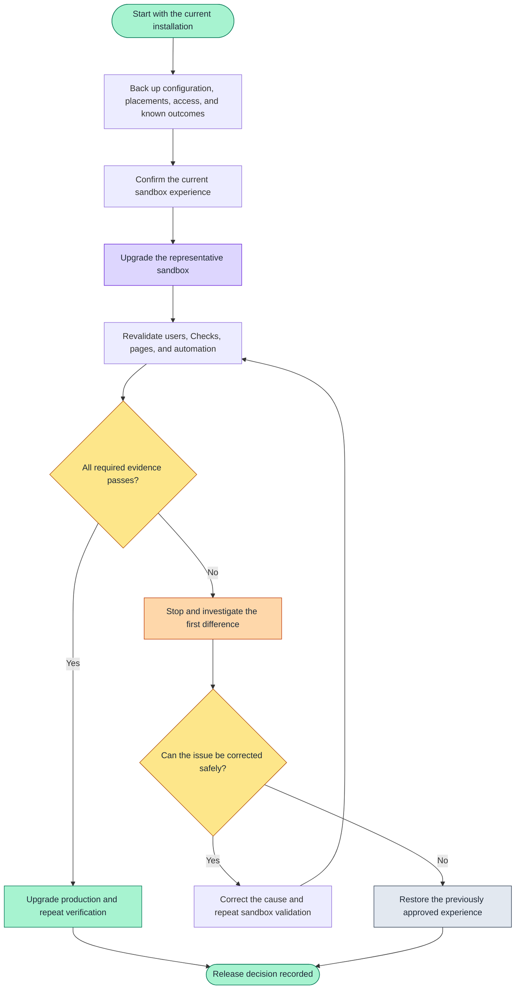

# Upgrade and revalidate an installation

> [!NOTE]
> On this page, preserve the current Record Health Check configuration, upgrade a representative
> sandbox, and verify the pages, access, automation, and business results before production.

Use this guide when Record Health Check is already installed. The goal is not simply to complete a
package upgrade; it is to prove that the checks, pages, access, and automations people rely on still
behave as expected afterward.

Test the upgrade in a representative sandbox before production.

## Upgrade decision flow



Text fallback:

```text
Back up -> baseline -> sandbox upgrade -> revalidate
                                         |
                                         +-> pass -> production -> verify again
                                         +-> fail -> investigate
                                                    +-> correct and retest
                                                    +-> restore approved state
```

## Before you start

An established installation can include configuration created by administrators in your org, Lightning page
placements, permission assignments, and automation. Capture enough information to restore and
retest that experience before changing the package.

Keep:

- a verified backup of your Record Health Check Sets and Checks created with
  [Back up and restore configuration](../production-operations/back-up-configuration.md);
- the currently installed package version;
- a list of Lightning pages that contain the card and the Check Set selected on each page;
- assignments for all packaged permission sets used in the org, including Card User, User, Admin,
  MCP Integration, and Error Log Publisher;
- a list of Flows, Apex callers, scheduled work, or integrations that receive Record Health Check
  Platform Events;
- one record that should pass and one that should need attention for each important Check Set.

Open the retrieved metadata files and confirm that every Check Set and Check created by an
administrator in your org is present. Store the backup somewhere the person responsible for the
release can restore it. Prove the restoration in a safe org before relying on it for rollback.

## Step 1: Confirm the current experience

Before upgrading, run the important Check Sets against the records you retained. Capture the
results, including Found, Expected, severity, and remediation guidance. This gives you a meaningful
before-and-after comparison instead of relying only on whether the package installation succeeds.

Also confirm that a regular user can run the card and that diagnostic details are hidden during
normal use.

## Step 2: Upgrade the sandbox

Confirm the current version in **Setup → Installed Packages → Record Health Check**, then choose an
approved target from [Package versions](./choose-a-package-version.md). Open its sandbox installation link,
sign in to the validation sandbox, and follow the Salesforce upgrade prompts. Salesforce indicates
that the package is already installed, shows the target version, and can complete the upgrade in
the background with an email notification.

Keep the Check Sets and Checks created by administrators in your org. A package upgrade should not
silently replace that configuration. Compare the upgraded configuration with the export if
anything appears missing, blank, inactive, or unexpectedly changed.

### Optional command-line installation

Teams that automate upgrades can use the Salesforce CLI:

```bash
sf org display --target-org <validation-org>
sf package install --package <package-version-id> --target-org <validation-org> --security-type AdminsOnly --upgrade-type DeprecateOnly --wait 30 --publish-wait 10 --no-prompt
```

The package version ID is the value beginning with `04t` in
[`config/package-releases.json`](../../config/package-releases.json). The command works on Windows,
macOS, and Linux. The first command confirms the target org before the upgrade changes it.

## Step 3: Revalidate what people use

| What to verify | What success looks like |
| --- | --- |
| Lightning pages | Each page still shows the intended Check Set |
| Passing scenario | The expected Checks pass |
| Attention scenario | The same guidance, severity, Found, Expected, and action remain meaningful |
| Regular user | The user can run the card without seeing diagnostic detail |
| Record Health Check administrator | Show Diagnostics is available only when intentionally enabled |
| Configuration created by administrators in your org | Check Sets and Checks match the approved pre-upgrade configuration |
| Flow or Apex automation | Every caller still receives and handles the expected outcomes |
| Platform Event automation | The intended Flow, Apex trigger, or integration receives events and does not repeat follow-up work |

For Flow verification, open **Setup → Flows**, open the approved Flow version, and use **Debug** with
a retained test record. Confirm that `FAIL` follows the health-result decision path rather than the
fault path.

Investigate a changed Check result before approving production. The cause may be the package,
configuration, user access, or changed Salesforce data; the retained before-and-after record helps
you distinguish them.

## Step 4: Decide whether to proceed

Proceed to production only when:

- the package installed successfully in the sandbox;
- the retained business scenarios behave as expected;
- regular-user access remains correct;
- configuration created by administrators in your org is intact;
- connected automation still works; and
- the backup and recovery path are understood.

Repeat the same verification after the production upgrade. Installation success alone is not the
release outcome; a working user experience is.

## If verification fails

Stop before production. Preserve the installation result and the evidence from the affected Check
Set.

| What changed | What to inspect first |
| --- | --- |
| The package did not install | The first Salesforce installation error and any missing org feature or dependency it names |
| A Check Set is missing | The configuration export, Active setting, target object, and Lightning page selection |
| A Check changed outcome | The underlying record data, the user's access, and the Check configuration |
| A user lost access | Permission-set assignments and the user's record, object, and field access |
| Automation stopped working | The Flow or Apex error, the outcome it received, and its permission assignments |
| Platform Event work changed | Event publication settings, repeated-event handling, and errors in the receiving Flow, Apex trigger, or integration |

Use [Show Diagnostics](../diagnostics/browser-console.md) when the card result needs
deeper evidence.

## If the sandbox upgrade cannot be approved

Do not assume that an unlocked package can be downgraded in place by installing an older `04t`
version over a newer one. The sandbox test exists to prevent an unapproved version from reaching
production.

If the upgraded sandbox cannot be approved:

1. stop connected automation that could act on unverified results;
2. preserve the installation error, changed results, package versions, and affected configuration;
3. investigate whether the problem is package behavior, configuration, access, or changed test data;
4. correct the cause and repeat the upgrade in a refreshed or otherwise representative sandbox; and
5. if your approved recovery plan requires uninstalling and reinstalling, follow
   [Uninstall and rollback](./uninstall.md), restore the exported Check Sets and Checks,
   and repeat every verification step.

Uninstalling and reinstalling is a separate destructive operation, not an automatic downgrade. Do
not use it without a verified configuration backup and an approved dependency-removal plan.

## Next steps

| Your next goal | Continue with |
| --- | --- |
| Operate the verified installation | [Operate in production](../production-operations/operate-in-production.md) |
| Investigate a result | [Troubleshoot Record Health Check](../diagnostics/browser-console.md) |
| Remove Record Health Check | [Uninstall and rollback](./uninstall.md) |
| Review connected surfaces | [Integration overview](../developer-guides/integration-options.md) |
| Back up or restore configuration | [Configuration backup and restore](../production-operations/back-up-configuration.md) |
