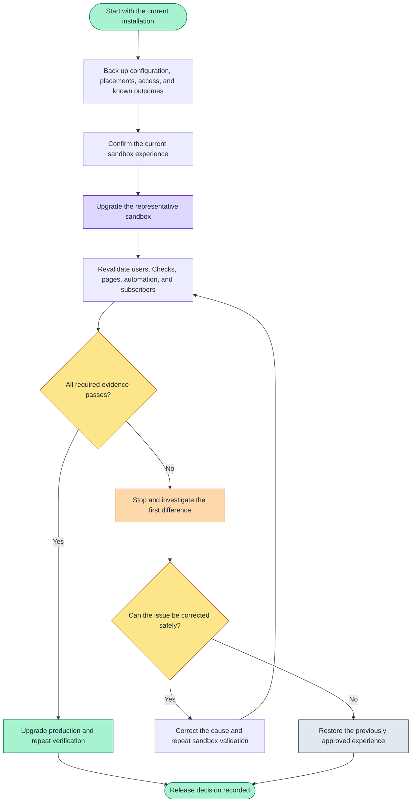

# Upgrade and revalidate an installation

> [!NOTE]
> On this page, preserve the current Record Health Check configuration, upgrade a representative
> sandbox, and verify the pages, access, automation, and business results before production.

Use this guide when Record Health Check is already installed. The goal is not simply to complete a
package upgrade; it is to prove that the checks, pages, access, and automations people rely on still
behave as expected afterward.

Test the upgrade in a representative sandbox before production.

## Upgrade decision flow



Text fallback:

```text
Back up -> baseline -> sandbox upgrade -> revalidate
                                         |
                                         +-> pass -> production -> verify again
                                         +-> fail -> investigate
                                                    +-> correct and retest
                                                    +-> restore approved state
```

## Before you start

An established installation can include configuration created by your organization, Lightning page
placements, permission assignments, and automation. Capture enough information to restore and
retest that experience before changing the package.

Keep:

- an export of your Record Health Check Sets and Checks;
- the currently installed package version;
- a list of Lightning pages that contain the card and the Check Set selected on each page;
- the users assigned **Record Health Check User** and **Record Health Check Admin**;
- a list of Flows, Apex callers, scheduled work, or event subscribers connected to the Framework;
- one record that should pass and one that should need attention for each important Check Set.

Store the backup somewhere the person responsible for the release can restore it. A backup is most
useful when its restoration has already been rehearsed in a safe org.

## Step 1: Confirm the current experience

Before upgrading, run the important Check Sets against the records you retained. Capture the
results, including Found, Expected, severity, and remediation guidance. This gives you a meaningful
before-and-after comparison instead of relying only on whether the package installation succeeds.

Also confirm that a regular user can run the card and that diagnostic details are hidden during
normal use.

## Step 2: Upgrade the sandbox

Open the current installation link from
[`config/package-releases.json`](../../config/package-releases.json), sign in to the validation
sandbox, and follow the Salesforce upgrade prompts.

Keep the organization's own Check Sets and Checks. A package upgrade should not silently replace
configuration your organization owns. Compare the upgraded configuration with the export if
anything appears missing, blank, inactive, or unexpectedly changed.

### Optional command-line installation

Teams that automate upgrades can use the Salesforce CLI:

```bash
sf package install \
  --package <package-version-id> \
  --target-org <validation-org> \
  --upgrade-type DeprecateOnly \
  --wait 30 \
  --publish-wait 10
```

The package version ID is the value beginning with `04t` in
[`config/package-releases.json`](../../config/package-releases.json). The command works on Windows,
macOS, and Linux.

## Step 3: Revalidate what people use

| What to verify | What success looks like |
| --- | --- |
| Lightning pages | Each page still shows the intended Check Set |
| Passing scenario | The expected Checks pass |
| Attention scenario | The same guidance, severity, Found, Expected, and action remain meaningful |
| Regular user | The user can run the card without seeing diagnostic detail |
| Framework administrator | Show Diagnostics is available only when intentionally enabled |
| Organization-owned configuration | Check Sets and Checks match the approved pre-upgrade configuration |
| Flow or Apex automation | Every caller still receives and handles the expected outcomes |
| Event subscribers | Publication and downstream behavior remain intentional and do not duplicate work |

Investigate a changed Check result before approving production. The cause may be the package,
configuration, user access, or changed Salesforce data; the retained before-and-after record helps
you distinguish them.

## Step 4: Decide whether to proceed

Proceed to production only when:

- the package installed successfully in the sandbox;
- the retained business scenarios behave as expected;
- regular-user access remains correct;
- organization-owned configuration is intact;
- connected automation still works; and
- the backup and recovery path are understood.

Repeat the same verification after the production upgrade. Installation success alone is not the
release outcome; a working user experience is.

## If verification fails

Stop before production. Preserve the installation result and the evidence from the affected Check
Set.

| What changed | What to inspect first |
| --- | --- |
| The package did not install | The first Salesforce installation error and any missing org feature or dependency it names |
| A Check Set is missing | The configuration export, Active setting, target object, and Lightning page selection |
| A Check changed outcome | The underlying record data, the user's access, and the Check configuration |
| A user lost access | Permission-set assignments and the user's record, object, and field access |
| Automation stopped working | The Flow or Apex error, the outcome it received, and its permission assignments |
| Event-driven work changed | Event publication settings, duplicate handling, and subscriber errors |

Use [Show Diagnostics](../guides/troubleshoot-with-show-diagnostics.md) when the card result needs
deeper evidence.

## Recover the previous experience

If the upgraded sandbox cannot be approved:

1. stop connected automation that could act on unverified results;
2. restore the previously approved package version when Salesforce permits that path;
3. restore the exported Check Sets and Checks;
4. restore Lightning page selections and permission assignments; and
5. rerun the retained passing and attention scenarios.

Do not resume the release until the restored org produces the expected user experience.

## Next steps

| Your next goal | Continue with |
| --- | --- |
| Operate the verified installation | [Operate in production](../guides/operate-in-production.md) |
| Investigate a result | [Troubleshoot Record Health Check](../guides/troubleshoot-with-show-diagnostics.md) |
| Remove the Framework | [Uninstall and rollback](uninstall-and-rollback.md) |
| Review connected surfaces | [Integration overview](../integration/README.md) |
