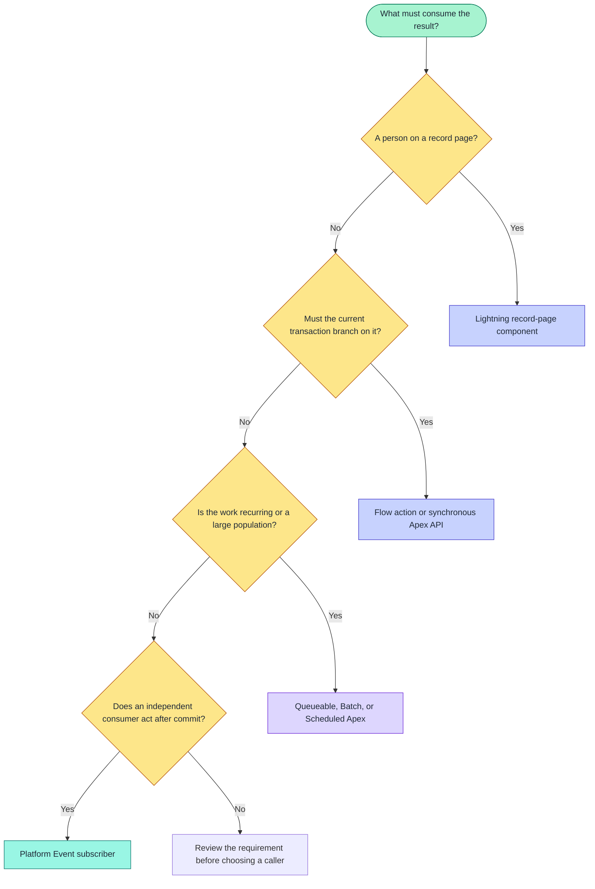

# Salesforce integrations

> [!NOTE]
> On this page, place each readiness decision on the right Salesforce surface by comparing how Lightning, Apex, Flow, and platform events start work, return outcomes, and handle failure.

> [!TIP]
> **Only placing the Lightning card?** Follow
> [Install and verify](../installation/install-and-verify.md), then return here when you need Apex,
> Flow, or platform-event subscribers.

Use this page to decide where a readiness decision belongs: a Lightning record page, Flow,
Apex, or an independent subscriber receiving an after-commit lifecycle event.

Record Health Check uses the same metadata-defined Check Sets and Checks across those surfaces. The
integration choice changes how the evaluation starts and how the caller receives the result; it
does not create a second configuration model.

## Recommended path

| Step | Guide | What you finish |
| ---: | --- | --- |
| 1 | [Lightning component](lightning-component.md) | Card on a record page: automatic vs explicit runs, visible rows |
| 2 | [Flow actions](flow-actions.md) | Branch in automation without custom Apex |
| 3 | [Lifecycle events](lifecycle-events.md) | After-commit publication behavior for independent subscribers |

For Apex API patterns (sync and async), use [API examples](../api/README.md). For subscriber
recipes, use [Platform Event subscriptions](../platform-events/README.md).

## Choose an integration

| Goal | Start here | What you will learn |
| --- | --- | --- |
| Show health to a user on a record page | [Lightning component](lightning-component.md) | Automatic versus explicit runs, visible rows, and optional user-initiated events |
| Make an immediate or asynchronous decision in code | [API examples](../api/README.md) | Choose synchronous Apex, Queueable, Batch, or Scheduled Apex |
| Branch in automation without custom Apex | [Flow actions](../integration/flow-actions.md) | Configure an Action and Decision element with explicit status paths |
| Notify independent automation after commit | [Platform Event subscriptions](../platform-events/README.md) | Build a Flow or Apex subscriber and handle replay or duplicate delivery |
| Implement a decision the other Evaluation Types cannot express | [Recent Account activity](../examples/apex/recent-activity.md) | Write the class used by a Verify with Apex Check |

### Integration decision flow



Text fallback:

```text
Record-page user -> Lightning component
Immediate transaction decision -> Flow action or synchronous Apex
Recurring or large population -> Queueable, Batch, or Scheduled Apex
Independent after-commit consumer -> Platform Event subscriber
```

## What Record Health Check is

Record Health Check is a synchronous evaluation framework for Salesforce records.

| Concept | Meaning |
| --- | --- |
| **Check Set** | The parent configuration and normal unit of execution |
| **Check** | One ordered check inside a Check Set |
| Immediate response | A run returns structured status data immediately |
| Lifecycle events | Optional events announce completed runs after the transaction commits |
| Access | Evaluation respects the running user's Salesforce access |

Start with a Check Set. Use a single Check only when your process intentionally needs one specific
check rather than the complete configured health assessment.

## What it is not

| Not this | Why |
| --- | --- |
| A database of historical results | Responses are transient unless a subscriber stores them |
| A Validation Rule | It reports health; it does not block record save |
| A remediation engine | It does not automatically update unhealthy records |
| A guaranteed-message queue | Platform-event publication and delivery are asynchronous and best effort |
| A record-change listener | A run happens only when Lightning, Apex, Flow, or scheduled code invokes it |
| A replacement for Salesforce security | It evaluates with the caller's effective access |
| An all-record bulk scanner | Public requests are deliberately bounded |

## Compare integration outputs

| Goal | Start here | Immediate output | Optional event source |
| --- | --- | --- | --- |
| Show health on a record page | [Lightning component](lightning-component.md) | Rows and Set summary | `USER_INITIATED`; automatic load is blocked |
| Make a code-level decision | [Apex API](../api/apex-api.md) | Typed Check or Set response | `APEX_API`, `SCHEDULED`, or `BATCH` |
| Branch in automation without code | [Flow actions](flow-actions.md) | Flow output variables and JSON | `FLOW` |
| React asynchronously or export results | [Platform events](lifecycle-events.md) | Event body | Depends on the publisher |
| Add a custom evaluation algorithm | [Recent Account activity](../examples/apex/recent-activity.md) | Normal Check result | Inherits the calling run |

## Evaluation model

```text
Check Set
├── Check A
├── Check B
└── Check C

evaluate(request) -> RecordHealthCheckResponse
                     ├── summary with outcome counts
                     └── results[] with evaluation and optional display data
```

The successful status is `PASS`, not `SUCCESS`.

| Status | Meaning |
| --- | --- |
| `PASS` | The configured health condition was satisfied |
| `FAIL` | Evaluation completed and found an unhealthy business condition |
| `SKIPPED` | Evaluation was intentionally prevented by applicability, dependency, or stop behavior |
| `UNABLE_TO_EVALUATE` | Configuration, access, or data conditions prevented a reliable conclusion |
| `ERROR` | Unexpected system or evaluator failure |

A Check Set uses the strongest contained result in this order:
`ERROR → UNABLE_TO_EVALUATE → FAIL → PASS → SKIPPED`.

## Contract versions

The synchronous response and lifecycle-event schemas carry independent contract-version fields.
Subscribers must use the contract field that arrives with each event instead of inferring a
schema from the installed package version.

## Basic Apex pattern

```apex
rhc.RecordHealthCheckResponse health = rhc.RecordHealthCheck.evaluate(
  rhc.RecordHealthCheckRequest.forCheckSet(
    'Account_Readiness', // Exact QualifiedApiName returned by Salesforce.
    accountId
  )
);

if (health.summary.failed > 0) {
  // Use health.results for business handling.
}
```

For method overloads, fields, limits, and exceptions, use the [Apex API reference](../api/apex-api.md).

## Basic Flow pattern

1. Add **Run Record Health Check Set** from the **Record Health Check** action category.
2. Provide **Check Set Qualified API Name** and **Record ID**.
3. Add a Decision element with explicit branches for the returned **Status**.
4. Connect the fault path.
5. Use the count outputs or Result JSON when the decision needs Check-level detail.

For every input and output, use the [Flow actions reference](flow-actions.md).

## Synchronous results versus events

| Output | Timing | Use |
| --- | --- | --- |
| Apex/Flow/LWC result | During the call | Make the current decision or render the card |
| Lifecycle event | After commit | Notify subscribers, persist history, export, or trigger independent automation |

Enabling events does not change the synchronous result. A successful synchronous run does not prove
that an event subscriber completed.

Lifecycle publication is off by default; error-log publication is on by default:

- Check Set **Publish User Run Event** enables one completed Set event.
- Check **Publish User Result Event** enables one event for that server-finalized Check.
- Check Set **Publish Error Log Event** publishes Framework `ERROR` diagnostics; uncheck it to opt
  that Check Set out without changing Salesforce debug logs.
- Automatic Lightning page-load runs and page refreshes never publish. If an automatic card hides
  Run and Rerun, show the action or call the Check Set from Apex or Flow when a subscriber needs an
  event.

## Limits

| Limit | Value |
| --- | --- |
| Records in one public Apex or Flow call | 200 |
| Concurrent Lightning Check evaluations | 5 |
| Platform-event publish chunk | 100 |

For a Set request, planned evaluations equal records × active Checks.

## Design for failures

Handle these cases separately:

| Case | Status / handling | Notes |
| --- | --- | --- |
| Valid unhealthy result | `FAIL` | The Check ran and found something that needs attention |
| Intentional non-run | `SKIPPED` | Applicability or a dependency kept the Check from running |
| No reliable conclusion | `UNABLE_TO_EVALUATE` | Card label: **Unable to Check**; Setup says **Unable to Evaluate** |
| Unexpected execution problem | `ERROR` | Card label: **System Error** |
| Exception before a response | Thrown fault | Invalid request, missing access, or a governor limit |
| Successful response, then rollback | Events suppressed | Publish After Commit events do not fire when the transaction rolls back |
| Duplicate or replayed subscriber work | Subscriber responsibility | Design event handlers to tolerate replay |

Use stable Statuses, Reason Codes, Failure Severities, and Qualified API Names for automation. Branch
automation on those fields rather than administrator-authored message text.

## Test before enabling events

1. Configure and run the Check Set in a sandbox.
2. Verify every status branch your integration handles.
3. Test with users who have different record and field access.
4. Confirm request volume stays within evaluation and event allocations.
5. Enable publication for one Set or Check at a time.
6. Verify commit, rollback, duplicate-processing, and subscriber-failure behavior.

## Next steps

- [API examples](../api/README.md)
- [Flow actions](../integration/flow-actions.md)
- [Flow API pattern](../api/flow.md)
- [Lightning component](lightning-component.md)
- [Platform Event subscriptions](../platform-events/README.md)
- [Lifecycle event behavior](lifecycle-events.md)
- [Reason Codes](../reference/contracts/reason-codes.md)
- [Configure Check Sets and Checks](../guides/configure-check-sets-and-checks.md)
