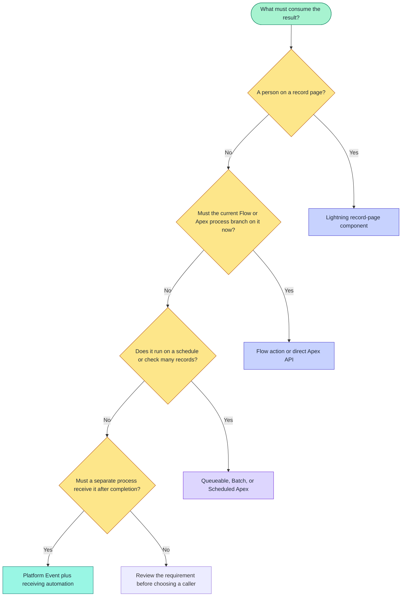

# Salesforce integrations

> [!NOTE]
> On this page, choose whether a health result belongs on a Lightning record page, in the current
> Flow or Apex process, in a large background job, or in optional Platform Event automation.

> [!TIP]
> **Only placing the Lightning card?** Follow
> [Install and verify](../installation/install-and-verify.md), then return here when you need Apex,
> Flow, Batch Apex, or Platform Event automation.

Use this page to decide who or what needs the result. Most implementations start with the Lightning
card, Flow, or Apex. Use Platform Events only when a separate Flow, Apex trigger, or external
integration must receive the result after the Record Health Check transaction completes successfully.

Record Health Check uses the same metadata-defined Check Sets and Checks across those surfaces. The
integration choice changes how the evaluation starts and how the caller receives the result; it
does not create a second configuration model.

## Recommended path

| Step | Guide | What you finish |
| ---: | --- | --- |
| 1 | [Lightning component](lightning-component.md) | Card on a record page: automatic vs explicit runs, visible rows |
| 2 | [Flow actions](flow-actions.md) | Branch in automation without custom Apex |
| 3 | [Agentforce actions](agentforce-actions.md) | Read-only native tools for agent record-health questions |
| 4 | [Agent tool REST API](agent-tool-rest-api.md) | Service-identity boundary for an approved MCP server |
| 5 | [Lifecycle events](lifecycle-events.md) | Optional Platform Events for a separate receiving process |

For immediate and background Apex patterns, use [API examples](../api/README.md). For receiving
Flow, Apex, or external-integration examples, use
[Platform Event subscriptions](../platform-events/README.md).

## Choose an integration

| Goal | Start here | What you will learn |
| --- | --- | --- |
| Show health to a user on a record page | [Lightning component](lightning-component.md) | Automatic versus explicit runs, visible rows, and optional user-initiated events |
| Make an immediate or background decision in code | [API examples](../api/README.md) | Choose the direct Apex API, Queueable, Batch, or Scheduled Apex |
| Branch in automation without custom Apex | [Flow actions](../integration/flow-actions.md) | Configure an Action and Decision element with explicit status paths |
| Answer record-health questions with a native agent action | [Agentforce actions](agentforce-actions.md) | Configure exact Check or Check Set tools and preserve five-state results |
| Call approved agent tools from a hosted MCP service | [Agent tool REST API](agent-tool-rest-api.md) | Authenticate a service identity and preserve the versioned tool contract |
| Notify a separate process after the health-check transaction completes | [Platform Event subscriptions](../platform-events/README.md) | Build a receiving Flow, Apex trigger, or external integration and handle repeated delivery |
| Implement a decision the other Evaluation Types cannot express | [Recent Account activity](../examples/apex/recent-activity.md) | Write the class used by a Verify with Apex Check |

### Integration decision flow



Text fallback:

```text
Record-page user -> Lightning component
Immediate Flow or Apex decision -> Flow action or Apex API
Scheduled work or many records -> Queueable, Batch, or Scheduled Apex
Separate process after successful completion -> Platform Event
```

## What Record Health Check is

Record Health Check evaluates Salesforce records and returns the results to whatever started the
run. The Lightning card, Flow action, and direct Apex API receive their response during the current
request. Queueable, Batch, and Scheduled Apex perform the work in the background.

| Concept | Meaning |
| --- | --- |
| **Check Set** | The parent configuration and normal unit of execution |
| **Check** | One ordered check inside a Check Set |
| Immediate response | The Lightning card, Flow, or direct Apex caller receives structured status data during its request. |
| Lifecycle events | Optional Platform Events announce completed runs only after Salesforce successfully commits the transaction. |
| Access | Evaluation respects the running user's Salesforce access |

Start with a Check Set. Use a single Check only when your process intentionally needs one specific
check rather than the complete configured health assessment.

## What it is not

| Not this | Why |
| --- | --- |
| A database of historical results | Record Health Check does not automatically create a result record. Flow, Apex, Batch Apex, or receiving automation must save one when history is required. |
| A Validation Rule | It reports health; it does not block record save |
| A remediation engine | It does not automatically update unhealthy records |
| A guaranteed-message queue | Platform Event publication or delivery can fail, and the same event can be delivered again. |
| A record-change listener | A run happens only when Lightning, Apex, Flow, or scheduled code invokes it |
| A replacement for Salesforce security | It evaluates with the caller's effective access |
| An all-record bulk scanner | Public requests are deliberately bounded |

## Compare integration outputs

| Goal | Start here | Immediate output | Optional event source |
| --- | --- | --- | --- |
| Show health on a record page | [Lightning component](lightning-component.md) | Rows and Set summary | `USER_INITIATED`; automatic load is blocked |
| Make a code-level decision | [Apex API](../api/apex-api.md) | Typed Check or Set response | `APEX_API`, `SCHEDULED`, or `BATCH` |
| Branch in automation without code | [Flow actions](flow-actions.md) | Flow output variables and JSON | `FLOW` |
| Answer through native Agentforce actions | [Agentforce actions](agentforce-actions.md) | Versioned structured Check or Check Set fields | `AGENT` |
| Call through an approved MCP service identity | [Agent tool REST API](agent-tool-rest-api.md) | Versioned JSON Check or Check Set fields | `AGENT` |
| Notify a separate process or export results | [Platform events](lifecycle-events.md) | Platform Event fields | Depends on what started the run |
| Add a custom evaluation algorithm | [Recent Account activity](../examples/apex/recent-activity.md) | Normal Check result | Inherits the calling run |

## Evaluation model

```text
Check Set
├── Check A
├── Check B
└── Check C

evaluate(request) -> RecordHealthCheckResponse
                     ├── summary with outcome counts
                     └── results[] with evaluation and optional display data
```

The successful status is `PASS`, not `SUCCESS`.

| Status | Meaning |
| --- | --- |
| `PASS` | The configured health condition was satisfied |
| `FAIL` | Evaluation completed and found an unhealthy business condition |
| `SKIPPED` | Evaluation was intentionally prevented by applicability, dependency, or stop behavior |
| `UNABLE_TO_EVALUATE` | Configuration, access, or data conditions prevented a reliable conclusion |
| `ERROR` | Unexpected system or evaluator failure |

A Check Set uses the strongest contained result in this order:
`ERROR → UNABLE_TO_EVALUATE → FAIL → PASS → SKIPPED`.

## Versions in API responses and Platform Events

The direct response and Platform Events have separate contract-version fields.
Receiving automation should read the contract-version field included in the response or event. Do
not guess the available fields from the installed package version.

## Basic Apex pattern

```apex
rhc.RecordHealthCheckResponse healthResponse = rhc.RecordHealthCheck.evaluate(
  rhc.RecordHealthCheckRequest.forCheckSet(
    'Account_Readiness', // Exact QualifiedApiName returned by Salesforce.
    accountId
  )
);

if (healthResponse.summary.failed > 0) {
  // At least one Account Check returned FAIL.
  // Use healthResponse.results to decide what this process should do next.
}
```

`rhc` is the installed package namespace. `Account_Readiness` represents a Check Set created by an
administrator in your org. Replace it with the exact **Qualified API Name** copied from Setup; do
not add or remove `rhc__` yourself.

For method overloads, fields, limits, and exceptions, use the [Apex API reference](../api/apex-api.md).

## Basic Flow pattern

1. Add **Run Record Health Check Set** from the **Record Health Check** action category.
2. Provide **Check Set Qualified API Name** and **Record ID**.
3. Add a Decision element with explicit branches for the returned **Status**.
4. Connect the fault path.
5. Use the count outputs or Result JSON when the decision needs Check-level detail.

For every input and output, use the [Flow actions reference](flow-actions.md).

## Synchronous results versus events

| Output | Timing | Use |
| --- | --- | --- |
| Apex/Flow/LWC result | During the call | Make the current decision or render the card |
| Platform Event | After Salesforce commits successfully | Notify a separate process, save history, or export results |

Enabling events does not change the result returned to the caller. A successful run does not prove
that the receiving Flow, Apex trigger, or integration completed.

Lifecycle publication is off by default; error-log publication is on by default:

- Check Set **Publish User Run Event** enables one completed Set event.
- Check **Publish User Result Event** enables one event for that server-finalized Check.
- Check Set **Publish Error Log Event** publishes Record Health Check `ERROR` diagnostics; uncheck it to opt
  that Check Set out without changing Salesforce debug logs.
- Automatic Lightning page-load runs and page refreshes never publish. If an automatic card hides
  Run and Rerun, show the action or call the Check Set from Apex or Flow when another process needs an
  event.

## Limits

| Limit | Value |
| --- | --- |
| Records in one public Apex or Flow call | 200 |
| Concurrent Lightning Check evaluations | 5 |
| Platform-event publish chunk | 100 |

For a Set request, planned evaluations equal records × active Checks.

## Design for failures

Handle these cases separately:

| Case | Status / handling | Notes |
| --- | --- | --- |
| Valid unhealthy result | `FAIL` | The Check ran and found something that needs attention |
| Intentional non-run | `SKIPPED` | Applicability or a dependency kept the Check from running |
| No reliable conclusion | `UNABLE_TO_EVALUATE` | Card label: **Unable to Check**; Setup says **Unable to Evaluate** |
| Unexpected execution problem | `ERROR` | Card label: **System Error** |
| Exception before a response | Thrown fault | Invalid request, missing access, or a governor limit |
| Successful response, then rollback | Events suppressed | Publish After Commit events do not fire when the transaction rolls back |
| Repeated or replayed event work | Receiving automation responsibility | Use `EventId__c` so repeated delivery does not repeat the same follow-up action. |

Use stable Statuses, Reason Codes, Failure Severities, and Qualified API Names for automation. Branch
automation on those fields rather than administrator-authored message text.

## Test before enabling events

1. Configure and run the Check Set in a sandbox.
2. Verify every status branch your integration handles.
3. Test with users who have different record and field access.
4. Confirm request volume stays within evaluation and event allocations.
5. Enable publication for one Set or Check at a time.
6. Verify successful commit, rollback, repeated-event handling, and receiving-automation failures.

## Next steps

- [API examples](../api/README.md)
- [Flow actions](../integration/flow-actions.md)
- [Flow API pattern](../api/flow.md)
- [Lightning component](lightning-component.md)
- [Platform Event subscriptions](../platform-events/README.md)
- [Lifecycle event behavior](lifecycle-events.md)
- [Reason Codes](../reference/contracts/reason-codes.md)
- [Configure Check Sets and Checks](../guides/configure-check-sets-and-checks.md)
