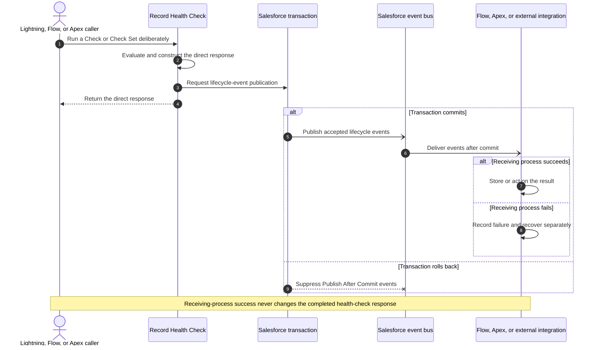

# Platform Events after a health-check run

> [!NOTE]
> On this page, decide whether a separate Flow, Apex trigger, or external integration needs a Check
> Set summary or individual Check results after a health-check run completes successfully.

> [!TIP]
> **Event navigation:** **Publication behavior** ·
> [Build receiving automation](../platform-events/README.md) ·
> [Subscribe externally](../platform-events/external-pub-sub-api.md) ·
> [Look up event fields](../metadata/README.md#platform-events)

Use these Platform Events only when the result returned directly to Lightning, Flow, or Apex is not
enough and a separate process must also receive completion information. This page explains exactly
what publishes, which setting controls it, what each event contains, and what receiving automation
must handle.

Start with the **Check Set Run** event when the receiving process needs one summary per record. Add
**Check Result** events only when it needs the status, Reason Code, and severity for individual
Checks.

## Card-only setup sequence

If only a person on the card should publish events:

1. In **Setup → Custom Metadata Types → Record Health Check Set → Manage Records**, open the Set and
   enable **Publish User Run Event**.
2. In **Setup → Custom Metadata Types → Record Health Check → Manage Records**, enable **Publish
   User Result Event** only on Checks whose individual results a receiver needs.
3. Keep **When Checks Run** as **When the user clicks Run** and keep Run or Rerun visible. Page-load
   evaluation never publishes result events.
4. Build and test the receiver before enabling publication in production.
5. Assign event object access to the receiving Flow user, Apex context, or integration. The packaged
   User and Admin Permission Sets include Set Run and Check Result access, but not the restricted
   Log event.

Flow, Apex, Queueable, Batch, and Scheduled callers ignore those two card checkboxes and use their
own `NONE`, `ACTIONABLE`, or `ALL` request value.

## Choose the event detail

| Another process needs… | Event | Use |
| --- | --- | --- |
| One summary for a completed Check Set | [`Record_Health_Check_Set_Run__e`](../metadata/event-set-run.md) | For the card, **Publish User Run Event**. For Apex or Flow, choose `ACTIONABLE` or `ALL`. |
| One result for selected Checks | [`Record_Health_Check_Result__e`](../metadata/event-check-result.md) | For the card, each Check's **Publish User Result Event**. For Apex or Flow, choose `ACTIONABLE` or `ALL`. |
| Restricted Record Health Check error details | [`Record_Health_Check_Log__e`](../metadata/event-log.md) | Check Set **Publish Error Log Event** (on by default; uncheck to opt out) |
| The immediate decision in the current transaction | Neither lifecycle event | Use the Lightning, Apex, or Flow response instead |

The Set Run and Check Result events are **high-volume Platform Events** configured as **Publish
After Commit**. They carry the
evaluated record's ID in `RecordId__c` when one is available, but exclude queries, messages, user
identity, and field values. Automatic record-page checks never publish;
explicit Run and Rerun actions can publish when enabled.

**Publish After Commit** means Salesforce delivers the event only if the transaction that ran the
health check completes successfully. This prevents another process from acting on a result from
work that Salesforce later rolled back. The caller cannot wait for the receiving process or use the
event for an immediate decision; Flow and Apex must branch on the result returned directly to them.

### Publish After Commit sequence



Text fallback:

```text
Caller -> Record Health Check -> direct response
                         |
                         +-> transaction commits -> event bus -> receiving process
                         |
                         +-> transaction rolls back -> no lifecycle event

Receiving-process failure is monitored and recovered separately from the original response.
```

## What these events are

- Minimal completion facts for one Check Set run and its server-finalized Check results.
- A way for a separate process to build history, notifications, exports, analytics, or other automation
  without coupling to the health-check call itself.

## What these events are not

- They are not the result returned directly to Lightning, Flow, or Apex.
- They are not a guaranteed or permanent audit log; Salesforce retains high-volume platform events
  for 72 hours, not indefinitely.
- They are not exactly-once commands. Receiving automation must handle repeated and replayed events safely.
- Publish acceptance does not prove delivery or successful receiving-process work.

For the end-to-end model, start with [Integrate Record Health Check](../integration/README.md).

## Prerequisites and sandbox quick start

1. Assign the receiving user access to the selected Platform Event and choose Flow, Apex, or Pub/Sub
   API for the receiving process. Custom fields on these Platform
   events are not field-level-security permissionable; granting event object access is enough for
   field visibility in receiving tools. The User and Admin Permission Sets grant create/read on Set
   Run and Check Result events. They do **not** grant `Record_Health_Check_Log__e`; grant Log object
   access separately to the users or integration that receive error diagnostics.
2. In a sandbox, enable **Publish User Run Event** on one Check Set. Leave Check publication off for the
   first test.
3. Subscribe before clicking Run or Rerun; automatic page load cannot publish.

If an automatic Check Set uses **Run Button Display = Hide**, users cannot publish lifecycle events
from that card because Run and Rerun are not available. A manual Check Set cannot use **Hide**
because users would have no way to start it.
4. Verify one `COMPLETED` Set event after commit, then test rollback, replay, and duplicate handling.
5. Enable individual Check events only after the Set receiving process is operating within event
   allocations.

## When events publish

Publishing runs from deliberate public Apex, packaged Flow, and user-initiated Lightning component
runs. Automatic Lightning record-page runs never publish.

| Source constant | Meaning in shipped callers |
| --- | --- |
| `APEX_API` | Public `RecordHealthCheck` Apex methods |
| `FLOW` | Packaged Flow actions |
| `USER_INITIATED` | An explicit Run or Rerun action in the Lightning component |
| `SCHEDULED` | Packaged scheduled Apex adapter |
| `BATCH` | Packaged Batch Apex adapter |
| `QUEUEABLE` | Packaged Queueable Apex adapter |
| `FUTURE` | Attribution value for legacy future callers migrating to Queueable |
| `AGENT` | Attribution value for agent/tool callers that use the public Apex API |
| `RUN_ON_LOAD` | Lightning automatic page load; controller keeps publication off |

Lightning automatic loads never publish. Programmatic callers publish only when they select
`ACTIONABLE` or `ALL`; they do not use the Lightning-card publication checkboxes. Receiving
automation must not start another publishing health-check run indefinitely from the event it
receives.

Keeping page-load publication off protects Platform Event allocations. Each published event still
carries the caller's source so operators can see which entry point produced it.

Publish failures are logged and **do not** change Check or Check Set results.

Events are chunked in batches of **100** (`PUBLISH_CHUNK_SIZE`).

## What controls publication

The control depends on what starts the run.

### User selects Run or Rerun on the Lightning card

| Setup field | Default | What it controls |
| --- | --- | --- |
| Check Set **Publish User Run Event** (`PublishUserRunEvent__c`) | Off | One Check Set Run event for the evaluated record after the explicit card run completes. |
| Check **Publish User Result Event** (`PublishUserResultEvent__c`) | Off | One Check Result event for that Check after the explicit card run completes, regardless of whether its result is `PASS`, `FAIL`, `SKIPPED`, `UNABLE_TO_EVALUATE`, or `ERROR`. |

Automatic page load and browser refresh never publish these result events. If **Run Button
Display** is **Hide**, the user has no Run or Rerun action to publish them.

### Flow, Apex, Queueable, Batch, or Scheduled Apex starts the run

The caller's required Event Publication choice controls publication directly. The Lightning-card
checkboxes above are not consulted.

| Event Publication | What is published |
| --- | --- |
| `NONE` | No Check Set Run or Check Result events. Use this when the caller handles or saves the response itself. |
| `ACTIONABLE` | Check Result events for `FAIL`, `UNABLE_TO_EVALUATE`, and `ERROR`, plus a completed Check Set Run heartbeat for every scanned record. All-pass and all-skipped runs therefore publish the Set Run heartbeat but no Check Result events. |
| `ALL` | A Check Result event for every result, including `PASS` and `SKIPPED`, plus the Check Set Run event. |

### Error Log events

Check Set **Publish Error Log Event** (`PublishErrorLogEvent__c`) is separate from result
publication. It is on by default and publishes `Record_Health_Check_Log__e` when Record Health Check
captures an `ERROR`. Uncheck it to opt that Check Set out. If Record Health Check cannot resolve a
Check Set, Log publication remains enabled.

For a user-initiated Lightning run, the completion call publishes the outcomes returned by the
progressive browser evaluation after filtering them to the requested record and the Checks in the
resolved Check Set. It does not run the Checks again while publishing. These `USER_INITIATED`
events are **client-attested advisory notifications**, not server-attested compliance evidence. A
user with Run permission controls the browser request that supplies the completion statuses.

A receiving process that makes a security-sensitive, compliance, or business-critical change must
run the Check again through Apex or Flow before acting. Apex- and Flow-originated events come
directly from their server-side evaluations.

## Contract versions on events

| Field | Value | Meaning |
| --- | --- | --- |
| `ContractVersion__c` | `1.0` | Lifecycle event contract (`RecordHealthCheckLifecyclePublisher.CONTRACT_VERSION`) |
| `FrameworkVersion__c` | Current package value | Record Health Check implementation version that produced the event |

This is separate from the `RecordHealthCheckResponse` returned directly to Apex. The event and Apex
response can change independently, so receiving automation must read the version from the event it
is processing.

Receiving integrations should store or inspect `ContractVersion__c`, not infer the event shape from
`FrameworkVersion__c`. A Record Health Check release can change implementation behavior without changing the event
schema; an incompatible event-field change requires a new contract version.

## What is never included on an event

The Set Run and Check Result events intentionally omit:

- User Id
- User-facing messages
- Found / Expected values
- SOQL and formula source
- `adminDetail` text

They include `RecordId__c` when one evaluated record is available. Receiving automation reads additional
Salesforce data using their own Salesforce access, the Record ID, metadata Qualified API Names, and
`RunId__c`.

---

## Event metadata references

| Platform Event | Detailed reference | Purpose |
| --- | --- | --- |
| `Record_Health_Check_Set_Run__e` | [Check Set Run Platform Event](../metadata/event-set-run.md) | One completion summary and outcome counts for a Check Set run |
| `Record_Health_Check_Result__e` | [Check Result Platform Event](../metadata/event-check-result.md) | One finalized public Check outcome |
| `Record_Health_Check_Log__e` | [Log Platform Event](../metadata/event-log.md) | Restricted Record Health Check `ERROR` details |

## Admin checklist before enabling

1. Review org Platform Event allocations and existing receiving Flows, Apex triggers, and integrations.
2. Enable publication only for deliberate LWC, Apex, Flow, scheduled, or batch runs.
3. Start with one receiving process in a sandbox, such as a Flow, Apex trigger, or export integration.
4. Use the Platform Event replay ID and error handling required by your business process. A
   publication or receiving-process error does not change the completed health result.
5. Treat `RecordId__c` as optional and correlate with `RunId__c` and metadata Qualified API Names.

## When an event is missing or processed twice

| Symptom | Likely cause | What to investigate |
| --- | --- | --- |
| No event after page open | Automatic runs are blocked from publishing | Click Run/Rerun or invoke Apex/Flow deliberately |
| No event after refreshing a hidden automatic card | Page refresh reevaluates the Check Set but never publishes user-run lifecycle events | Show Run and Rerun, or call the Check Set from Apex or Flow; metadata validation warns when publication is enabled for a hidden automatic Check Set |
| No event after selecting Run or Rerun on the card | The Check Set or Check publication field is off, the transaction rolled back, or publication failed | Check the relevant metadata field, source, logs, and commit outcome. |
| No event after Flow or Apex | Event Publication is `NONE`, `ACTIONABLE` found no actionable result, the transaction rolled back, or publication failed | Check the caller's Event Publication choice, returned statuses, logs, and commit outcome. |
| Repeated processing | Replay or a receiving-process retry delivered the event again | Keep unique by `EventId__c`; make follow-up work safe to repeat |
| Two valid events describe near-simultaneous card runs | Separate tabs or intentional reruns completed independently | Treat delivery as at least once. Keep each `EventId__c`; apply a reviewed business-window key only if the process must collapse equivalent runs. |
| Health result succeeded but no requested event arrived | Publication can fail independently and is warning-only to the health caller | Monitor Record Health Check logs and receiver health; never treat a successful health response as proof of event delivery. |
| Missing record context | The run had no single record, or a record ID was not available at publish | Correlate with `RunId__c` and metadata names; `RecordId__c` is set only when available |
| Receiving process failed | Its Salesforce limits, access, or business logic failed after publication | Monitor and retry that process separately; the health result is already final. |

## Diagnostics events are a separate channel

`Record_Health_Check_Log__e` serves a different purpose from the two result events. It carries
restricted Record Health Check `ERROR` details and uses **Publish Immediately**.

| Property | Lifecycle events (Set / Check) | Diagnostics event (Log) |
| --- | --- | --- |
| Purpose | Completion facts | Errors that need reproducing |
| Default | Optional per Set/Check (off) | **On by default**; opt out per Check Set with `PublishErrorLogEvent__c` |
| Publish behavior | Publish After Commit | **Publish Immediately**: survives the rollback a failing check triggers |
| Carries error detail | No: record ID + counts/status only | Yes: record ID plus message, exception type, stack trace |
| Results included | Only the results selected by the card metadata or caller's Event Publication choice | `ERROR` only |
| Access | Users and integrations assigned event access | **Restricted**: grant access only to the error-monitoring users or integration. |

The Log event is independent of **Publish User Run Event** and **Publish User Result Event**. It is controlled
by the Check Set's default-on **Publish Error Log Event** field. Its complete event body, security
requirements, repeated-call guard, possibilities, and known limitations are in the [Log Platform
Event reference](../metadata/event-log.md).

## Related

- [Platform Event receiving-process guides](../platform-events/README.md)
- [External Pub/Sub API integration](../platform-events/external-pub-sub-api.md)
- [Apex API](../api/apex-api.md)
- [Flow actions](flow-actions.md)
- [Lightning component](lightning-component.md)
- [Check Set fields](../metadata/fields-check-set.md): Publish User Run Event and Publish Error Log Event
- [Check fields](../metadata/fields-check.md): Publish User Result Event
- [Check Set Run Platform Event](../metadata/event-set-run.md)
- [Check Result Platform Event](../metadata/event-check-result.md)
- [Log Platform Event](../metadata/event-log.md)
- [Revalidate an installation](../installation/upgrading.md)
- [Reason Codes](../reference/contracts/reason-codes.md)
