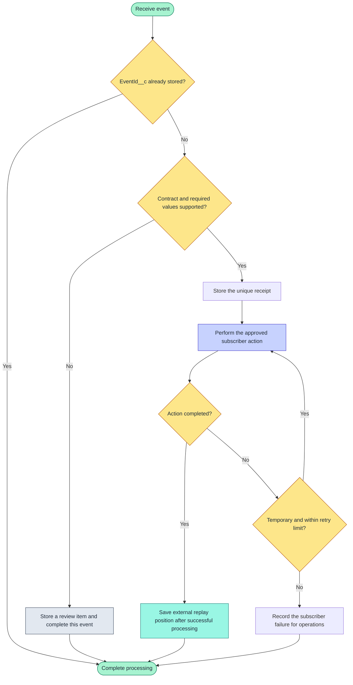

# Subscribe to Record Health Check Platform Events

> [!NOTE]
> On this page, choose a Record Health Check event and build a Flow or Apex subscriber that handles duplicate delivery, access, retention, and subscriber failures.

Record Health Check publishes three Platform Events. Check Set Run and Check Result events announce
finalized outcomes after the publishing transaction commits. Log events report restricted
Framework errors immediately when error-event publication is enabled.

The event names shown in subscriber Apex use the package namespace, such as
`rhc__Record_Health_Check_Set_Run__e`. Salesforce Setup may display the label without that prefix.

## Choose an event

| Event guide | Publish behavior |
| --- | --- |
| [Check Set Run](check-set-run.md) | Publish After Commit - one completion summary |
| [Check Result](check-result.md) | Publish After Commit - one outcome per selected Check |
| [Log](error-log.md) | Publish Immediately - restricted Framework errors |

Start with Check Set Run when counts and overall completion are sufficient. Add Check Result only
when automation needs Check-level status, severity, or Reason Code. Restrict Log subscribers because
messages and stack traces can contain organization-specific information.

## Pick a task

| I want to… | Guide |
| --- | --- |
| One completion summary for a Check Set | [Check Set Run](check-set-run.md) |
| One finalized outcome for each Check | [Check Result](check-result.md) |
| Restricted Framework error diagnostics | [Log](error-log.md) |
| Send events to middleware, a warehouse, or monitoring | [External Pub/Sub API](external-pub-sub-api.md) |

These pages teach subscriber implementation. For publication timing, eligible execution sources,
and trust boundaries, use [Lifecycle event behavior](../integration/lifecycle-events.md). For
exact event fields, use the [Platform Event metadata reference](../metadata/README.md#platform-events).

## Choose Flow or Apex

| Subscriber | Best fit | Main constraint |
| --- | --- | --- |
| Platform event-triggered Flow | Declarative routing, record creation, and notifications | Runs asynchronously and needs a lasting duplicate check |
| Apex trigger | Complex transformations, controlled bulk DML, and reusable handlers | Requires tests, access review, and independent monitoring |

Both subscribers receive events asynchronously. Neither can change the synchronous health-check
response. Store `EventId__c` in a unique field when processing must happen once, and store the
Salesforce replay ID only when an external subscriber needs a replay position.

## Subscriber ideas

Start with the smallest event and action that satisfy the requirement. Persist the event before
performing a side effect when missed work would matter.

| Idea | Start with | Suggested action | Guardrail |
| --- | --- | --- | --- |
| Run-history dashboard | Check Set Run | Store one summary per `EventId__c` and report by Check Set, source, and outcome | Derive status from counts; do not use Run ID as the unique receipt |
| Critical-result alert | Check Result | Notify an owning queue for selected `FAIL`, `UNABLE_TO_EVALUATE`, or `ERROR` outcomes | Add deduplication and a cooldown so repeated runs do not create alert noise |
| Remediation work queue | Check Result | Create a review item keyed by Event ID and route by Check API name, status, Reason Code, and severity | Require human review before changing the evaluated record unless the action is independently validated |
| Trend or compliance export | Check Result | Send minimal outcomes to a warehouse for longitudinal analysis | Define retention, record-ID handling, and deletion obligations before exporting |
| Release health monitoring | Set Run and Log | Compare completion and restricted error rates before and after a release | Keep Log event data in a restricted destination; never send stack traces to broad channels |
| External observability | Set Run and Log | Consume with Pub/Sub API and correlate by Run ID | Checkpoint only after durable processing and alert before the 72-hour replay window is exhausted |

Avoid using an event subscriber for a decision the current transaction must make. Use the
synchronous Apex, Flow, or Lightning response for that decision.

## Failure and recovery policy

Define these outcomes before activating a subscriber:



Text fallback:

```text
Receive -> duplicate? -> supported? -> store receipt -> perform action
             |              |                              |
             +-> complete   +-> review and complete        +-> success: checkpoint
                                                           +-> temporary: retry
                                                           +-> permanent: record failure
```

| Outcome | Response |
| --- | --- |
| Duplicate event | Return successfully after finding the existing unique `EventId__c` receipt |
| Temporary dependency or lock failure | Retry with a bounded attempt count; make repeated processing safe |
| Invalid or unsupported event | Persist a review item and complete processing so one poison event does not block later events |
| Partial destination DML failure | Record each failed Event ID and error; do not silently treat the complete batch as successful |
| Subscriber unavailable | Recover from the last successful replay position or from durable receipts |
| Outage longer than 72 hours | Reconcile from subscriber-owned history or source records; the event bus is not a permanent ledger |

For an Apex platform event trigger, use
`EventBus.TriggerContext.currentContext().setResumeCheckpoint(replayId)` after each successfully
processed event when ordered recovery is required. Throw `EventBus.RetryableException` only for a
transient condition and cap retries. Do not retry an invalid event indefinitely. These mechanisms
complement, rather than replace, a unique `EventId__c` receipt.

## Shared subscriber checklist

1. Grant read access to the selected Platform Event only to the subscriber identity.
2. Create a lasting receipt or destination record with a unique `EventId__c` field.
3. Route using API fields such as Status, Reason Code, source, and metadata names.
4. Treat new field values as a review path instead of dropping the event.
5. Keep processing safe when Salesforce retries or replays an event.
6. Monitor subscriber failures separately from publication and health-check results.
7. Define retention for every stored result or diagnostic record.
8. Test commit, rollback, duplicate delivery, missing optional fields, and restricted access.
9. Test a temporary failure, an invalid event, a partial DML failure, and recovery after downtime.
10. Alert on subscriber failures, processing lag, event allocation usage, and records awaiting review.

## Related

- [API examples](../api/README.md)
- [Lifecycle event behavior](../integration/lifecycle-events.md)
- [Platform Event metadata](../metadata/README.md#platform-events)
- [External Pub/Sub API subscriber](external-pub-sub-api.md)
- [Reason Codes](../reference/contracts/reason-codes.md)
