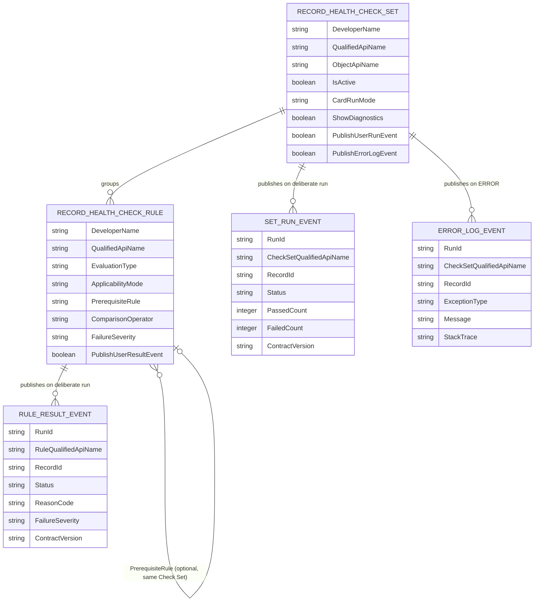

# Reference: Data model

> [!NOTE]
> On this page, see how Check Set, Rule, and the three Platform Events relate to each other, and
> understand that a Rule result is a runtime value, not a row in a health-history database.

Use this page alongside the [Metadata field references](../../metadata/README.md) when you need the
shape of the data model rather than the meaning of one field.

## Entity relationship diagram

## Reading the diagram

| Relationship | Cardinality | Meaning |
| --- | --- | --- |
| Check Set to Rule | One to many | A Check Set groups an ordered list of Rules; a Rule belongs to exactly one Check Set |
| Rule to Rule (prerequisite) | Optional, zero or one | A Rule may name another Rule in the **same Check Set** as its prerequisite; the server enforces that scope on every call |
| Check Set to Set Run event | One completed run to zero or one event | Published only for a deliberate run, only when **Publish User Run Event** is checked |
| Rule to Rule Result event | One finalized result to zero or one event | Published only for a deliberate run, only when that Rule's **Publish User Result Event** is checked |
| Check Set to Log event | One `ERROR` to zero or one event | Published whenever the Framework records an `ERROR` for that Check Set, unless **Publish Error Log Event** is unchecked |

The Custom Metadata relationship (Check Set to Rule) is a deploy-time, structural link: it exists
whether or not any Rule ever runs. The event relationships are runtime, best-effort, and optional:
they exist only for the specific runs an administrator has opted into publishing.

## Results are ephemeral, not a stored history

Nothing in this data model stores a Rule result. A run produces:

1. A typed response returned directly to the caller (Apex, Flow, or the Lightning component), which
   exists only for the duration of that call.
2. Optionally, one or more platform events, which Salesforce retains for a bounded window (72 hours
   for high-volume events) and which a subscriber must capture if it wants to keep the data longer.

There is no `Record_Health_Check_Result__c` object, no history related list, and no built-in trend
report. If your business process needs a queryable history of readiness over time, subscribe to
`Record_Health_Check_Set_Run__e` and/or `Record_Health_Check_Rule_Result__e` and write your own
storage object. See [Architecture: Out of scope](architecture.md#16-out-of-scope) and
[Platform Event subscriptions](../../platform-events/README.md).

## Why prerequisite is a name, not a formal foreign key

`PrerequisiteRule__c` stores a Developer Name rather than a Custom Metadata relationship field,
because the engine needs to detect a cycle (`CIRCULAR_DEPENDENCY`) and a Rule ordered after the Rule
that requires it (`DEPENDENCY_NOT_IN_RUN`) at runtime, inside a single already-loaded Check Set. See
[Reason Codes: Applicability and prerequisites](../contracts/reason-codes.md#applicability-and-prerequisites).

## Related

- [Check Set fields](../../metadata/fields-check-set.md)
- [Rule fields](../../metadata/fields-check-rule.md)
- [Metadata reference](../../metadata/README.md)
- [Lifecycle events](../../integration/lifecycle-events.md)
- [Architecture](architecture.md)
