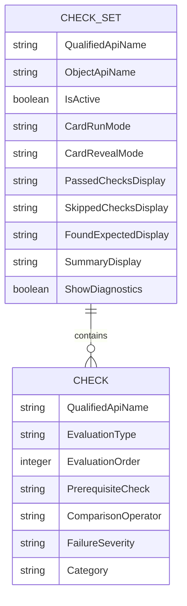

# Record Health Check data model

> [!NOTE]
> This page explains what the package stores, what exists only while a Check runs, and what your team
> must create if the org needs health-check history or reports.

## What the package stores

Custom Metadata is deployable configuration, not business data. You manage these definitions from
**Setup → Custom Metadata Types → Manage Records**; they do not appear as Account-style tabs or
create a result-history table.

Record Health Check stores its configuration in two Custom Metadata Types:

| Custom Metadata Type | What one record represents |
| --- | --- |
| **Record Health Check Set** (`Record_Health_Check_Set__mdt`) | A group of Checks for one Salesforce object and the way its Lightning card behaves |
| **Record Health Check** (`Record_Health_Check__mdt`) | One data-quality question, how to evaluate it, and what to show when it passes, fails, is skipped, or cannot be evaluated |

Every Check must belong to one Check Set through the required **Check Set**
(`Record_Health_Check_Set__c`) Custom Metadata relationship. A Check Set can contain many Checks.

Text fallback: one Check Set contains zero or more Checks. Every Check belongs to exactly one Check
Set.

For the purpose of every field, see [Check Set fields](../../metadata/fields-check-set.md) and
[Check fields](../../metadata/fields-check.md).

## How prerequisite Checks are connected

**Prerequisite Check** (`PrerequisiteCheck__c`) is an optional text field on a Check. Enter the
Developer Name of an earlier active Check in the same Check Set. Do not enter its Check Title or
Qualified API Name.

Example:

| Check | Developer Name | Evaluation Order | Prerequisite Check |
| --- | --- | --- | --- |
| Billing country is present | `Billing_Country_Present` | 10 | Leave blank |
| Billing state is valid | `Billing_State_Valid` | 20 | `Billing_Country_Present` |

Salesforce runs `Billing_State_Valid` only when `Billing_Country_Present` returns `PASS`. A missing,
later, or circular prerequisite is reported by the Check Set validation and produces the documented
result when the Check runs. See
[Reason Codes: Applicability and prerequisites](../contracts/reason-codes.md#applicability-and-prerequisites).

## What happens to a result

A health-check result is not saved as a Salesforce record automatically. Apex, Flow, Batch Apex,
and the Lightning component receive the result for the current run. After that transaction ends,
the package has no result-history record to query or report on.

The package does **not** install a `Record_Health_Check_Result__c` custom object or a result-history
related list.

### Recommended: Save returned results when history is required

If users need reports, trends, or a permanent audit history, your team must first create a custom
object for that purpose. For example, create **Health Check Result** with API name
`Health_Check_Result__c`, then add the fields your process needs, such as:

Create the object from **Setup → Object Manager → Create → Custom Object**. Add only the fields
your reporting requirement needs, configure field-level security, create a tab or report type when
users require one, and use the [Flow action](../../api/flow.md) to map returned result fields into a
Create Records element. These are customer-owned components and are not installed by the package.

| Example custom field | Suggested API name | Value to save |
| --- | --- | --- |
| Checked Record ID | `Checked_Record_Id__c` | `result.evaluation.recordId` |
| Check API Name | `Check_API_Name__c` | `result.evaluation.checkQualifiedApiName` |
| Status | `Status__c` | `result.evaluation.status` |
| Reason Code | `Reason_Code__c` | `result.evaluation.reasonCode` |
| Severity | `Severity__c` | `result.evaluation.severity` |
| Run ID | `Run_Id__c` | `response.runId` |

The object and field names above are examples; they are not installed by Record Health Check. Save
the returned values in your Flow or Apex process. For a complete Batch Apex example, see
[Batch Apex](../../api/batch.md).

### Optional: Publish Platform Events

Use Platform Events when a separate Flow, Apex trigger, or external integration should receive the
results after the run. Publishing an event does not create a reportable history record. The receiver
must save the fields to an object if long-term storage is required.

| Platform Event | What one event describes |
| --- | --- |
| `Record_Health_Check_Result__e` | One Check result for one checked record |
| `Record_Health_Check_Set_Run__e` | The final Status counts for one checked record and Check Set |
| `Record_Health_Check_Log__e` | Restricted troubleshooting detail for an `ERROR` log entry |

Programmatic Apex and Flow runs choose `NONE`, `ACTIONABLE`, or `ALL`. A person clicking the
Lightning card's Run or Rerun button uses the two publication settings in Custom Metadata. Automatic
record-page checks do not publish health-result events. Error Log events have their own Check Set
setting. See [Lifecycle events](../../integration/lifecycle-events.md) before creating a receiver.

## What is metadata and what is run data?

| Data | Exists after installation? | Saved by the package after each run? |
| --- | --- | --- |
| Check Sets and Checks | Yes, as Custom Metadata | Not applicable; these records are configuration |
| Apex or Flow response | Only during the request | No |
| Lightning card result | Only in the current component state | No |
| Platform Event message | Only when publication is enabled or requested | No custom-object history is created |
| Your team's result custom object | Only if your team creates it | Yes, when your Flow or Apex code inserts a record |

## Related

- [Check Set fields](../../metadata/fields-check-set.md)
- [Check fields](../../metadata/fields-check.md)
- [Lifecycle events](../../integration/lifecycle-events.md)
- [Platform Event receivers](../../platform-events/README.md)
- [Where results go](../../guides/where-results-go.md)
